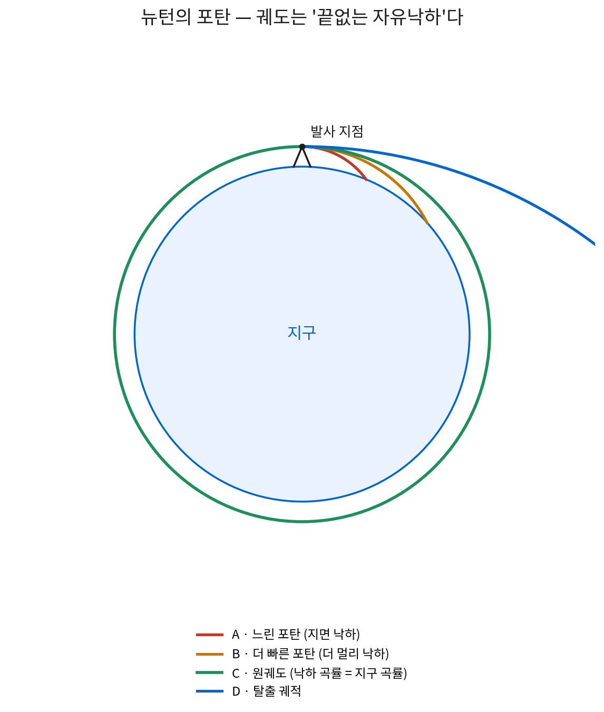
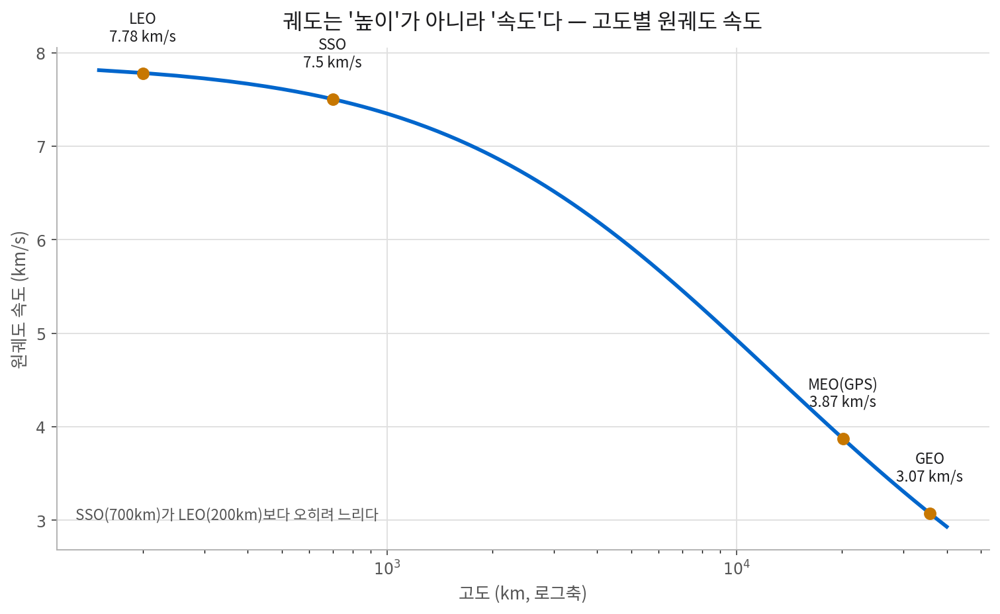
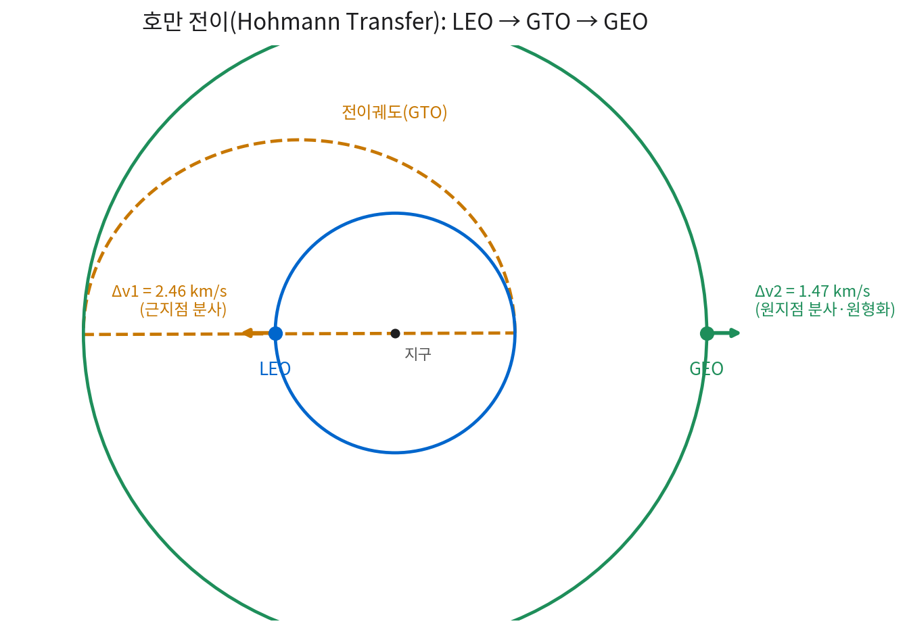
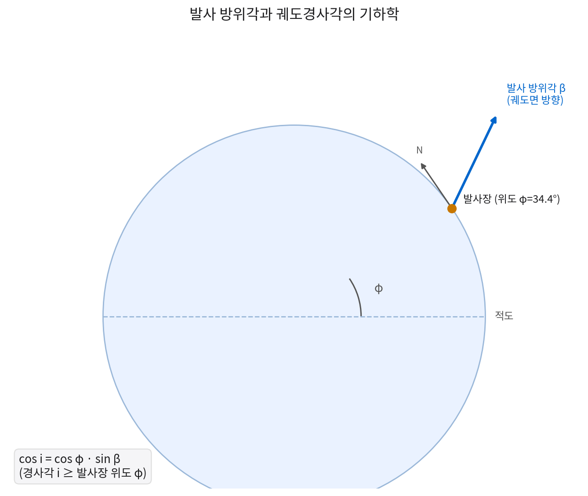
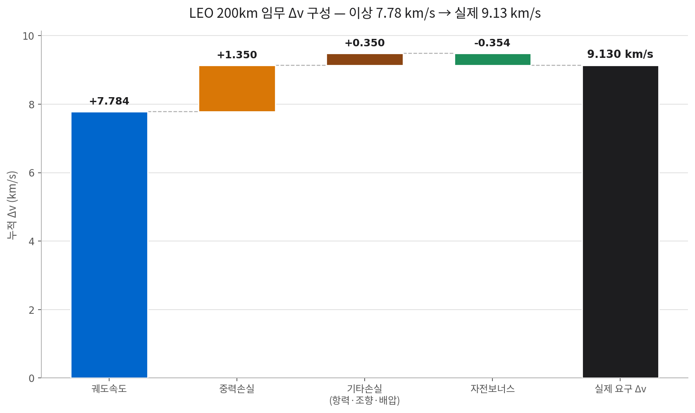
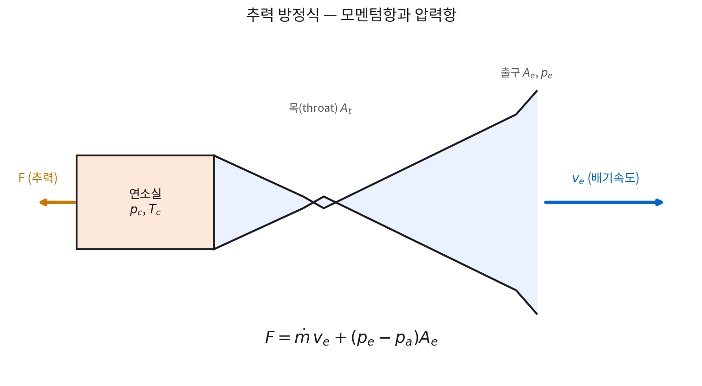
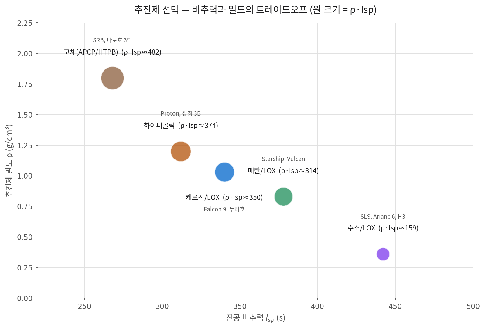
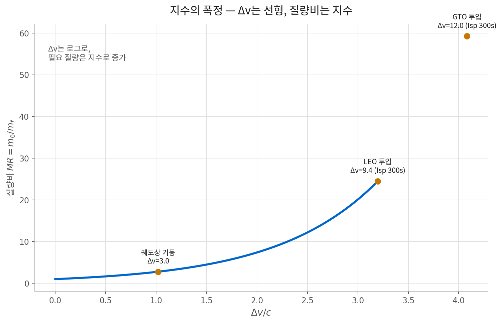
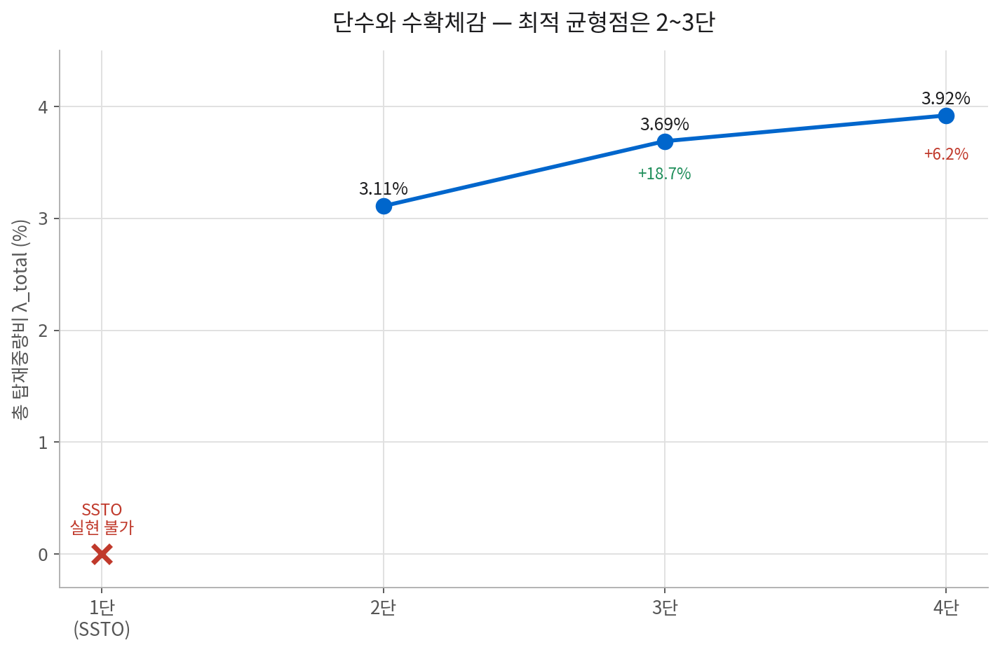
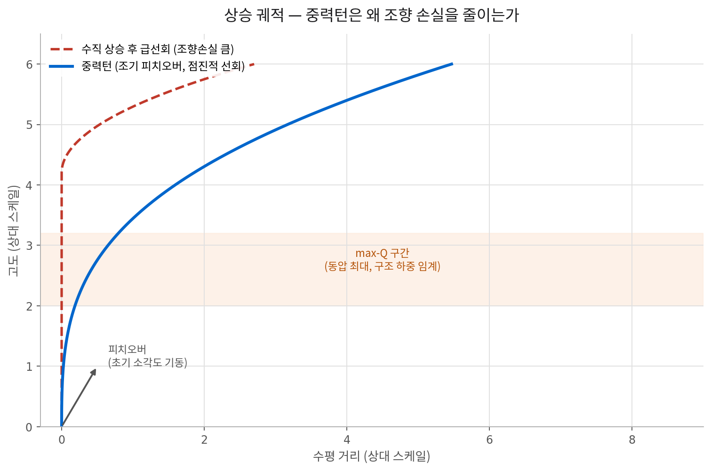

# 2주차 · 로켓 비행의 기초 이론
### Fundamentals of Rocket Flight

> **우주수송정책과 발사체 기술** — Week 02
> 주교재: Edberg & Costa, *Design of Rockets and Space Launch Vehicles*, 2nd ed., Ch. 3–4
> 보조교재: Sutton & Biblarz, *Rocket Propulsion Elements*, 9th ed., Ch. 2–3
> 서술 구조 참고: [ERAU, *Introduction to Aerospace Flight Vehicles* — "Rockets & Launch Vehicle Performance"](https://eaglepubs.erau.edu/introductiontoaerospaceflightvehicles/chapter/rocket-performance/)

---

## 서론

- 발사체 정책의 거의 모든 쟁점 — 가격, 진입장벽, 국가 지원의 정당화, 재사용 논쟁 — 은 결국 **하나의 지수함수**에서 파생됨
- 로켓은 공기·지면을 밀지 않음. 자신이 실은 질량을 뒤로 던지고 반작용으로 전진하는 기계
  - 이 사실이 발사체 산업의 원가 구조·진입장벽·국가 지원 정당성 논쟁까지 규정
- 이번 주 논리 전개: **궤도역학(요구) → 추력·비추력(공급) → 로켓방정식(회계) → 다단화(설계) → 속도 손실(현실)**
  - 각 단계는 앞 단계의 결과를 입력으로 받음 → 순서를 건너뛰면 뒤의 정량 분석 불성립

**흔한 오해 두 가지**

- **오해 1**: "기술이 발전하면 발사비는 얼마든지 내려간다"
  - 화학추진 비추력은 열역학적 상한에 이미 근접
  - 지난 60년간 비추력은 사실상 정체
  - 비용 하락의 원천 = 물리 성능 ✗ / 생산방식·재사용·운용 효율 ✓ (5·13주차 논쟁의 출발점)
- **오해 2**: "발사비는 결국 에너지 비용이다"
  - 1 kg을 LEO 투입하는 데 필요한 역학적 에너지 ≈ 32 MJ (≈ 8.9 kWh)
  - 실제 발사 가격은 그 수천 배
  - 이 괴리를 이해하는 것이 강좌 경제 파트 전체의 열쇠(§7)

## 학습 목표

- [ ] **임무 Δv 예산 산정**: vis-viva 방정식으로 목표 궤도 속도·에너지 산출, 경사각·J₂ 섭동·태양동기 제약 반영, 손실·자전 기여를 더해 발사체 실공급 Δv 산정
- [ ] **추력 vs 비추력 구분**: 추력방정식의 모멘텀항·압력항 구분, 비추력 물리적 상한이 T꜀/M에 지배되는 이유 설명
- [ ] **로켓방정식 적용**: 치올코프스키 방정식 유도, 질량비·구조계수·탑재중량비로 SSTO 실현 불가 원리와 다단화의 우회 메커니즘 정량 증명
- [ ] **설계 민감도 해석**: 비추력·구조질량·Δv 요구량 변화가 탑재중량에 증폭되는 정도(탄성도) 계산, 이것이 리스크 구조·kg당 가격에 연결되는 경로 설명

---

## 1. 궤도 역학: 뉴턴의 포탄

- 출발점: 1687년 『프린키피아』의 사고실험
- 설정: 산 정상에서 포탄을 수평으로 발사

| 케이스 | 결과 |
|---|---|
| **A. 느린 포탄** | 포물선으로 지면 낙하 — 일반적 투사체 |
| **B. 더 빠른 포탄** | 더 멀리 날지만 여전히 낙하, 궤적은 타원의 일부 |
| **C. 충분히 빠른 포탄** | 낙하 곡률 = 지구 표면 곡률 → 영원히 떨어지나 닿지 않음 → **원궤도** |
| **D. 더욱 빠른 포탄** | 타원이 길어지다 닫히지 않음 → **탈출 궤적** |

- 수치 감각: 8 km 수평이동 ⇒ 지표가 약 5 m 아래로 휘어짐 / 자유낙하 1초 낙하거리도 약 4.9 m
  - 초속 8 km ⇒ '낙하'와 '지구 곡률'이 상쇄

> **재구성 1**: 로켓 ≠ '위로 올라가는' 기계 / 로켓 = '옆으로 가속하는' 기계
> - 수직 상승 = 대기 탈출용 수단일 뿐
> - 에너지의 압도적 대부분 = 수평 속도 확보에 사용

### 1.1 세 개의 문턱 — 우주속도

| 구분 | 명칭 | 값 | 정의 | 임무 대응 |
|---|---|---|---|---|
| 제1우주속도 | 원궤도 속도 | 7.91 km/s | $\sqrt{\mu/R_\oplus}$ | 인공위성 궤도 투입 |
| 제2우주속도 | 탈출속도 | 11.19 km/s | $\sqrt{2\mu/R_\oplus} = \sqrt{2}\,v_{c}$ | 달·행성 탐사 |
| 제3우주속도 | 태양계 탈출속도 | 약 16.7 km/s | 지구 공전속도를 최대 활용한 태양 탈출 | 보이저·뉴호라이즌스급 |

- **통찰 ① — 탈출은 궤도보다 41%만 더 비쌈**
  - 제2우주속도 = 제1우주속도 × √2
  - 저궤도 도달 = 태양계 어디로든 가는 길의 절반 이상을 이미 통과한 셈
  - → 궤도상 급유·우주정거장 개념이 반복 제기되는 물리적 근거
- **주의 — 이 값들은 '이상값'**
  - 대기·자전 없는 지표에서 순간 부여 속도 가정
  - 실제 발사체는 대기·중력손실로 1.5~2.0 km/s 추가 공급 필요(§5)

### 1.2 궤도란 '높이'가 아니라 '속도'다

$$
v_c = \sqrt{\frac{\mu}{r}}, \qquad v_{esc} = \sqrt{2}\,v_c
$$

- $\mu = GM = 3.986\times10^{5}\ \text{km}^3/\text{s}^2$(지구 중력상수), $r$ = 지구중심 거리

| 궤도 / 지점 | 고도 (km) | 궤도반경 $r$ (km) | 원궤도 속도 (km/s) | 비궤도에너지 $\varepsilon$ (MJ/kg) | 대표 임무 |
|---|---|---|---|---|---|
| 지표(비회전) | 0 | 6,378 | 7.91 | −62.5 | — |
| 저궤도 LEO | 200 | 6,578 | 7.78 | −30.3 | 유인·군집위성·ISS |
| 태양동기 SSO | 700 | 7,078 | 7.50 | −28.2 | 지구관측·정찰 |
| 중궤도 MEO | 20,200 | 26,578 | 3.87 | −7.50 | GPS·Galileo |
| 정지궤도 GEO | 35,786 | 42,164 | 3.07 | −4.73 | 통신·기상 |

> **핵심**: 고도 5배 높은 SSO(700 km) 속도가 LEO보다 오히려 낮음 → 궤도 결정 요인 = 높이 ✗ / 총 역학에너지 ✓

### 1.3 vis-viva 방정식

$$
v^2 = \mu\left(\frac{2}{r} - \frac{1}{a}\right), \qquad \varepsilon = \frac{v^2}{2} - \frac{\mu}{r} = -\frac{\mu}{2a}
$$

- **해석 1 — 궤도는 에너지의 다른 이름**
  - $\varepsilon$은 오직 $a$(궤도장반경)에만 의존
  - '궤도를 바꾼다' = '에너지를 주입한다' → 그 대가가 Δv
- **해석 2 — 왜 근지점에서 가속하는가**
  - $v$가 큰 지점 → 같은 Δv에 $v^2$ 증가폭 더 큼 (오베르트 효과, Oberth effect)
  - → 전이 기동은 근지점에서 수행하는 것이 효율적
- **해석 3 — Δv는 스칼라 가산이 아님**
  - 방향 다르면 단순 합산 불가
  - 궤도경사각 변경 = 삼각함수 계산, 매우 고비용 (GTO 28.5°→0°: 약 1.8 km/s)

**호만 전이(LEO → GEO) 실제 계산**

| 단계 | 계산 | 결과 |
|---|---|---|
| STEP 1 · 근지점 분사 (LEO→GTO) | $a=(6{,}578+42{,}164)/2=24{,}371$ km, $v_p=10.24$ km/s, $v_c=7.78$ km/s | $\Delta v_1 = 2.46$ km/s |
| STEP 2 · 원지점 분사 (GTO→GEO) | $v_a=1.60$ km/s, $v_{GEO}=3.07$ km/s | $\Delta v_2 = 1.47$ km/s |
| **합계** (경사각 변경 제외) | | **3.93 km/s** |

> **정책적 함의**
> - 발사체가 GTO까지만 투입 → 나머지 1.47 km/s는 위성이 자체 부담
> - → 위성 추진제 질량·궤도상 수명 결정
> - → 'GTO 투입 능력 몇 톤' 광고, direct-GEO 프리미엄 가격의 근거
> - 전기추진 궤도상승(EOR) = 이 Δv를 시간(수개월)과 맞바꾸는 선택

### 1.4 궤도면과 경사각

$$
\cos i = \cos\phi \cdot \sin\beta \quad\Rightarrow\quad i_{min} = \phi
$$

- $i$: 궤도경사각 / $\phi$: 발사장 위도 / $\beta$: 발사 방위각(정북=0°, 정동=90°)
- **발사장 위도보다 작은 경사각 = 직접 투입 불가**

| 궤도 유형 | 경사각 $i$ | 발사 방위각 | 지구자전 기여 | 대표 임무 |
|---|---|---|---|---|
| 순행 저경사 | $i=\phi$(최소) | 90°(정동향) | 최대 $+465\cos\phi$ | GTO·통신위성·ISS(51.6°) |
| 극궤도 | $i=90°$ | 0° 또는 180° | 0 | 정찰·과학관측 |
| 역행/태양동기 | $i>90°$ | 180° 초과 | 음(−) — 벌칙 | SSO 지구관측·기상 |
| 적도궤도 | $i=0°$ | 적도 발사장만 | 최대 +465 | GEO 직접 투입 |

- $i<\phi$ 궤도 필요 시 → 도그레그(dogleg) 기동 또는 궤도상 평면변경 필요 → 큰 Δv 유발
- **결론**: 발사장 위도 = 국가가 바꿀 수 없는 조건 → 시장 접근성을 구조적으로 제한

### 1.5 J₂ 섭동과 태양동기궤도(SSO)

- 실제 지구 = 자전으로 적도 방향 팽대 (적도-극 반경 차 약 21 km, $J_2=1.0826\times10^{-3}$)
- 이 비대칭 → 궤도면을 서서히 회전 → 오차 ✗ / 설계에 이용되는 자원 ✓

$$
\frac{d\Omega}{dt} = -\frac{3}{2}J_2 n\left(\frac{R_\oplus}{p}\right)^2\cos i, \qquad
\frac{d\omega}{dt} = \frac{3}{4}J_2 n\left(\frac{R_\oplus}{p}\right)^2(5\cos^2 i - 1)
$$

- SSO 조건: 승교점 세차율 $d\Omega/dt$ = 지구 공전 각속도(+0.9856°/일) → $\cos i<0$ → $i>90°$(역행궤도) 필수

| 고도 (원궤도) | 필요 경사각 | 대표 임무 |
|---|---|---|
| 200 km | 96.3° | 초저궤도 관측 |
| 400 km | 97.0° | 고해상도 광학 정찰 |
| 700 km | 98.2° | 아리랑·기상·해양 관측 |
| 1,000 km | 99.5° | 장수명 과학·기상 위성 |

- **SSO = 자전 보너스 ✗ / 자전 벌칙 ✓**
  - 위도 34.4°에서 $i=98°$ → 방위각 약 190°(남남서) 발사 필요
  - 자전 동향 기여: 정동향 +384 m/s → SSO 약 −65 m/s (약 450 m/s 차이)
  - → 지수 관계로 탑재중량 손실 크게 증폭

> **응용 사례 — 몰니야(Molniya) 궤도**
> - 임계경사각 63.4°/116.6°: $d\omega/dt=0$ → 근지점 인수 회전 없음
> - 소련: 이 경사각의 고이심률 타원궤도 채택 → 원지점이 항상 북반구 상공 유지
> - 고위도 통신 문제를 궤도역학으로 우회한 사례 (6주차 냉전 우주정책 연계)

### 1.6 임무별 Δv 예산

- Δv 예산 = 발사체 설계의 '요구사항' = 정책 결정자가 바꿀 수 없는 유일한 항목
- 예산·조직·규제는 조정 가능 / 9.4 km/s는 조정 불가

| 임무 목표 | 이상 Δv (km/s) | 실제 요구 (km/s) | 비고 |
|---|---|---|---|
| LEO 200 km 원궤도 투입 | 7.78 | 9.3 ~ 9.5 | 손실 1.5~1.8, 자전보너스 −0.1~−0.46 |
| SSO 700 km 투입 | 7.50 | 9.4 ~ 9.7 | 역행궤도 → 자전 보너스 상실 |
| GTO 투입 (LEO 경유) | +2.46 | 11.8 ~ 12.0 | 상업 통신위성 발사의 표준 성능 지표 |
| GEO 직접 투입 | +3.93 | 13.0 ~ 13.5 | 경사각 변경 포함 시 추가 증가 |
| 달 전이궤도(TLI) | +3.13 | 12.4 ~ 12.8 | 유인 탐사·상업 달 착륙선 |
| 화성 전이궤도(TMI) | +3.6 | 12.9 ~ 13.5 | 발사창(launch window)에 따라 변동 |

- 사업 지연·예산 삭감 발생해도 물리적 요구는 불변
- 성능 목표 하향 = 시장 세그먼트 포기 → **리스크는 하방에 쏠림**

---

## 2. 추력과 비추력

### 2.1 로켓은 무엇을 '밀고' 나아가는가

$$
\left.\frac{d}{dt}(mv)\right|_{\text{계}} = 0 \quad\Rightarrow\quad m\,dv = -v_e\,dm
$$

- 고립계 운동량 보존: 질량 $dm$을 상대속도 $v_e$로 방출 → 본체는 반대 방향 속도증분 획득
- **제트엔진과의 결정적 차이 — 작동유체를 실어야 함**
  - 제트엔진: 대기 중 산소 사용 → 연료만 탑재
  - 로켓: 산화제까지 탑재 필요 (통상 산화제 = 연료의 2~6배)
- **추진제 = 소모품이자 구조물**
  - 이륙질량의 85~96% = 추진제
  - 그 탱크가 기체 구조 대부분 차지 → 발사체 = 사실상 '얇은 껍질의 압력용기'
- **물리적 상한 존재 — 화학추진의 천장**
  - 방출속도 $v_e$ = 화학적 에너지 밀도·분자량이 상한 결정 (열역학 문제)
  - 60년간 거의 변화 없음

> 반복될 명제: 발사 비용 하락 = '더 좋은 로켓' ✗ / '더 싸게 만들고 여러 번 쓰는 로켓' ✓ (물리 성능 천장이 낮기 때문)

### 2.2 추력 방정식

$$
F = \dot{m}\,v_e + (p_e - p_a)A_e \equiv \dot{m}\,c
$$

- $\dot m$: 추진제 질량유량 / $v_e$: 배기속도 / $p_e$: 출구압 / $p_a$: 외기압 / $A_e$: 출구면적 / $c$: 유효배기속도

- **모멘텀항** $\dot m v_e$
  - 추력의 주된 성분
  - 단, Δv를 결정하는 것은 $v_e$뿐 → 이 비대칭이 설계 핵심 긴장
- **압력항** $(p_e-p_a)A_e$
  - 고도 의존성의 원인
  - 해수면: 음(−) → 추력 감소 / 진공: 양(+) → 추력 증가
  - 진공추력 통상 해수면추력보다 10~20% 큼
- **설계상 귀결**
  - 해수면 1단 엔진: 팽창비 작게 (과팽창에 의한 유동 박리 회피)
  - 진공 상단 엔진: 팽창비 크게 (배기속도 극대화)

### 2.3 비추력(Isp)

$$
I_{sp} = \frac{F}{\dot m\,g_0} = \frac{c}{g_0}\ [\text{s}], \qquad c = I_{sp}\,g_0\ [\text{m/s}]
$$

- $g_0 = 9.80665\ \text{m/s}^2$(표준중력가속도)
- 단위 '초' = 시간 ✗ / 환산상수의 결과 ✓
  - 유래: 중량 기준($\text{lbf}/(\text{lbm/s})$) 정의 시 단위 소거 → 초만 남는 역사적 유산
  - 계산 시 물리량은 항상 $c=I_{sp}g_0$로 환산

- **추력 vs 비추력**
  - 추력(F) → '들어 올릴 수 있는가' (이륙 시 T/W>1 필요)
  - 비추력 → '얼마나 멀리 갈 수 있는가'
- **해수면 vs 진공 Isp — 조건 확인 필수**
  - 예: 케로신/LOX 1단 → 해수면 약 265~285 s, 진공 약 310~340 s

### 2.4 비추력의 천장은 열역학이 정한다

$$
v_e = \sqrt{\frac{2\gamma}{\gamma-1}\cdot\frac{R_u T_c}{M}\left[1-\left(\frac{p_e}{p_c}\right)^{\frac{\gamma-1}{\gamma}}\right]}
$$

- $\gamma$: 비열비 / $R_u$: 일반기체상수 / $T_c$: 연소실 온도 / $M$: 배기가스 평균분자량

- **지배 인자 1 — $T_c/M$의 제곱근**
  - 배기속도 ∝ (연소온도/분자량)의 제곱근
  - '뜨겁게, 그리고 가볍게' 태울수록 유리
  - 수소/LOX 압도적 우위 이유: 배기 생성물(H₂O + 잔여 H₂)의 분자량이 작음
- **지배 인자 2 — 연소실 압력의 수확체감**
  - $p_c$ 상승 → $v_e$ 증가하나 이득은 로그에 가깝게 둔화
  - 반면 터보펌프 부하·냉각·구조 하중은 급격히 증가
- **귀결 — 천장이 낮고, 이미 닿아 있음**
  - $T_c$: 재료 내열·냉각 한계에 묶임
  - $M$: 화학적으로 수소보다 가벼운 생성물 없음
  - 실용 화학추진 $I_{sp}$ 상한 ≈ **450~465 s** (1960년대 이후 유의미한 돌파 없음)

### 2.5 추진제 선택 — 밀도비추력

- 질문: 가장 높은 비추력의 수소가 왜 1단에 잘 안 쓰이는가?
- 답: 밀도 문제 — 탱크 부피 = 구조질량 → 실제 지표 = 밀도비추력($\rho \cdot I_{sp}$)

| 추진제 조합 | 진공 $I_{sp}$ (s) | 밀도 (g/cm³) | $\rho\cdot I_{sp}$ | 주 용도 | 대표 사례 |
|---|---|---|---|---|---|
| 고체(APCP/HTPB) | 250~290 | 1.80 | 약 486 | 부스터·군용 | SRB, 나로호 3단 |
| 하이퍼골릭 | 310~340 | 1.20 | 약 384 | 상단·궤도기동 | Proton, 창정 3B |
| 케로신/LOX | 310~340 | 1.03 | 약 340 | 1단 주력 | Falcon 9, 누리호 |
| 메탄/LOX | 350~380 | 0.83 | 약 303 | 재사용 1단 | Starship, Vulcan |
| 수소/LOX | 420~465 | 0.36 | 약 162 | 상단·고에너지 | SLS, Ariane 6, H3 |

- **단별 최적해 상이**
  - 1단: 중력손실 저감 위해 밀도 중요 → 케로신 선호
  - 상단: 이미 저손실 구간 → 비추력이 지배 → 수소 선호
  - → '케로신 1단 + 수소 상단' 구조가 흔한 이유
- **메탄의 부상**
  - 성능·밀도의 절충 + 그을음(coking) 적음 → 재점화·재사용 정비에 유리
  - 메탄 채택 = 성능 선택 ✗ / 재사용이라는 운용 모델 선택의 결과 ✓

### 2.6 노즐 팽창비와 고도 보상

$$
\varepsilon_A = \frac{A_e}{A_t}, \qquad \text{최적조건: } p_e = p_a\ (\text{완전팽창})
$$

- **과팽창** ($p_e<p_a$, 지상)
  - 배기류 노즐 벽 박리 → 횡방향 진동·구조 손상
  - → 1단 팽창비를 크게 못 키우는 근본 제약
- **부족팽창** ($p_e>p_a$, 고고도)
  - 팽창 미완료 배기 방출 → 에너지 손실
  - 해법: 상단에 큰 팽창비 노즐 별도 배치 → **다단화가 이 문제도 해결**
- **고도보상 노즐** (에어로스파이크 등)
  - 오래전부터 연구되었으나 냉각·질량·복잡도 부담이 이득 상쇄 → 실용화 제한적

- 참고 수치: SL/진공 성능 차이 대체로 10~20% / 팽창비 1단 약 10~40, 진공 전용 상단 60~200

---

## 3. 로켓방정식 (치올코프스키 방정식)

### 3.1 유도

- 1903년 치올코프스키 제시 — 우주공학에서 가장 중요한 단일 방정식

1. **운동량 보존** (외력 없는 계): $m\,dv = -v_e\,dm$
2. **변수 분리**: $dv = -v_e\left(\dfrac{dm}{m}\right)$
3. **적분** ($m_0 \to m_f$, $v_e$ 상수 가정): $\displaystyle\int dv = -v_e\int \frac{dm}{m}$
4. **결과**:

$$
\Delta v = v_e \ln\left(\frac{m_0}{m_f}\right) = I_{sp}\,g_0\,\ln\left(\frac{m_0}{m_f}\right)
$$

- 전제: 외력(중력·항력) 없는 계
- → Δv는 '이상 속도증분' → 실제 발사 시 손실 별도 가산 필요(§5)

### 3.2 지수의 폭정 (The Tyranny of the Rocket Equation)

$$
MR \equiv \frac{m_0}{m_f} = \exp\left(\frac{\Delta v}{c}\right), \qquad \text{추진제 질량분율} = 1-\frac{1}{MR}
$$

- Δv는 로그 증가 / 필요 질량은 지수 증가 → 이 비대칭이 우주 접근을 근본적으로 고비용화

| 요구 Δv (km/s) | $I_{sp}$ 300s | $I_{sp}$ 350s | $I_{sp}$ 450s | 해석 |
|---|---|---|---|---|
| 3.0 (궤도상 기동) | MR 2.8 / 64% | MR 2.4 / 58% | MR 1.97 / 49% | 여유 있는 설계 가능 |
| 6.0 (준궤도급) | MR 7.7 / 87.0% | MR 5.7 / 82.6% | MR 3.9 / 74.3% | 구조 여유 급감 |
| 9.4 (LEO 투입) | MR 24.4 / 95.9% | MR 15.5 / 93.5% | MR 8.4 / 88.1% | 단단 구성은 사실상 불가 |
| 12.0 (GTO 투입) | MR 59.1 / 98.3% | MR 33.0 / 97.0% | MR 15.2 / 93.4% | 다단화가 필수 |

> $I_{sp}$ 300 s로 LEO 도달 시 이륙질량의 95.9%가 추진제 필요 → 남은 4.1%로 탱크·엔진·구조·전자장비·페어링·탑재체 전부 감당 → 이 4%가 산업의 진입장벽

### 3.3 질량 회계 — 구조계수와 탑재중량비

$$
\varepsilon = \frac{m_s}{m_s+m_p} \quad(\text{구조계수}), \qquad
\lambda = \frac{m_{pl}}{m_0} \quad(\text{탑재중량비}), \qquad
\frac{1}{MR} = \lambda + \varepsilon(1-\lambda)
$$

$$
\lambda = \frac{1/MR - \varepsilon}{1-\varepsilon}, \qquad MR = \exp\left(\frac{\Delta v}{c}\right)
$$

> **핵심 결과**: 탑재중량비는 요구 Δv·비추력·구조계수, 단 세 입력으로 결정

| 기호 | 명칭 | 정의 | 현실적 범위 | 결정 요인 |
|---|---|---|---|---|
| $\varepsilon$ | 구조계수 | 건조질량/(건조질량+추진제) | 0.05~0.12 | 재료·탱크형식·추진제밀도·재사용장치 |
| $\lambda$ | 탑재중량비 | 탑재체 질량/이륙 총질량 | 0.01~0.04 | 위 세 입력의 종속변수 |
| $MR$ | 질량비 | 연소 전 질량/연소 후 질량 | 3~25 | 요구 Δv와 비추력 |

### 3.4 왜 단단 궤도투입(SSTO)은 실현되지 않는가

- $\Delta v=9.4$ km/s 대입 시, $1/MR<\varepsilon$이면 $\lambda<0$ → 자기 구조도 궤도에 못 올림

| 단단 구성 ($\Delta v=9.4$ km/s) | $\varepsilon=0.06$ | $\varepsilon=0.08$ | $\varepsilon=0.10$ | $\varepsilon=0.12$ | 현실적 $\varepsilon$ 범위 |
|---|---|---|---|---|---|
| $I_{sp}$ 350s (케로신/LOX) | 0.50% | 불가 | 불가 | 불가 | 0.05~0.07 |
| $I_{sp}$ 400s (메탄/LOX) | 3.30% | 1.20% | 불가 | 불가 | 0.07~0.09 |
| $I_{sp}$ 450s (수소/LOX) | 6.26% | 4.22% | 2.09% | 불가 | 0.10~0.12 |

- 수소: $I_{sp}$ 높으나 밀도 낮음 → 탱크 커지고 극저온 단열 필요 → $\varepsilon$ 악화(0.10~0.12)
- 케로신: $\varepsilon$ 낮으나 $I_{sp}$ 낮음
- → 실현 가능 조합 전부 $\lambda\approx0$ 또는 음수 영역

> **정책적 교훈 — X-33·VentureStar의 실패**
> - 1990년대 미국: SSTO 실현 목표로 대규모 투자
> - 복합재 극저온 탱크 질량 목표 미달 → 사업 중단
> - 물리적 여유 없는 설계 = 단 하나의 기술 미달로 사업 전체 붕괴
> - '기술 낙관론 기반 정책 결정'의 대표적 실패 사례 (6주차 우주왕복선 사례 연계)

---

## 4. 다단화

### 4.1 원리

- 본질: 추진제 소진된 탱크·엔진 = 그 순간부터 순수한 죽은 질량
- 1단 연소 종료 시 그 구조질량(통상 이륙질량의 5~8%) → 기능 없음
- 분리 시 2단은 훨씬 작은 $m_0$에서 출발 → 로켓방정식 지수 항이 여러 작은 지수로 분할

$$
\Delta v_{total} = \sum_i c_i \ln\left(\frac{1}{\lambda_i + \varepsilon_i(1-\lambda_i)}\right), \qquad \lambda_{total} = \prod_i \lambda_i
$$

- 각 단 탑재중량비 $\lambda_i$는 곱셈 결합 — 각각 작지만(0.15~0.35) 단단 구성의 음수 $\lambda$보다 압도적으로 유리
- **Δv는 더해지고, 손실은 곱해진다**

- 구성 방식
  - **직렬형**(tandem): 순차 연소 — Falcon 9·누리호
  - **병렬형**(parallel): 부스터 동시 연소 — Ariane 5·SLS·Atlas V
  - **드롭탱크형**: 추진제 탱크만 분리
- 부수 효과: 1단(큰 추력·작은 팽창비) + 상단(작은 추력·큰 팽창비) 각각 최적화 → 노즐 고도보상 문제까지 함께 해결

### 4.2 단 간 Δv 최적 배분

$$
\max \prod_i \lambda_i \quad \text{s.t.} \quad \sum_i \Delta v_i = \Delta v_{req}
$$

- **결과 1 — 동일 성능이면 균등 배분**이 최적 (다단화 이득 계산의 기준 케이스)
- **결과 2 — 고성능 단에 더 많은 Δv**
  - 상단 $c$가 크면(수소 상단) 최적해는 상단에 Δv 더 배분
- **결과 3 — 최적해는 좁고 민감**
  - 최적점 근처 $\lambda_{total}$은 평평하나 벗어나면 급격히 악화
  - 한 단의 건조질량 목표 초과 → 배분 재설계 필요

> 발사체 형상(단수·추진제 조합·단별 Δv 배분) = 미학적 선택 ✗ / 목표 시장에서 역산되는 최적화 결과 ✓ (LV-BizLab M1 모듈이 이 계산 지원)

### 4.3 단수와 수확체감

- 조건: $I_{sp}$ 330 s, $\varepsilon=0.07$, $\Delta v=9.4$ km/s, 균등 배분

| 단수 $n$ | 단별 Δv | 단별 $\lambda_i$ | 총 $\lambda_{total}$ | 직전 대비 개선 |
|---|---|---|---|---|
| 1단(SSTO) | 9.40 | $\lambda<0$ | 실현 불가 | — |
| 2단 | 4.70 | 0.176 | 3.11% | — |
| 3단 | 3.13 | 0.333 | 3.69% | +18.7% |
| 4단 | 2.35 | 0.445 | 3.92% | +6.2% |

- 2→3단: 약 19% 탑재중량 개선 / 3→4단: 6%에 그침
- **최소 필요 단수 = 2~3, 그 이상은 물리적으로 거의 무의미**
- 상충: 단수 증가 → 분리 기구·점화 시퀀스·항전 계통 추가
  - 각 분리 이벤트가 직렬 신뢰도를 곱셈으로 저하
  - 개발비·발사운용비 증가

---

## 5. 속도 손실 — 이상 Δv와 실제 Δv

- 로켓방정식 전제: 무중력·무대기 환경
- 실제 상승 궤적: 중력·대기가 지속적으로 속도 갉아먹음 → LEO 임무 총 Δv의 약 15~20%

$$
\Delta v_{공급} = \Delta v_{궤도} + \Delta v_{중력} + \Delta v_{항력} + \Delta v_{조향} + \Delta v_{배압} - \Delta v_{자전}
$$

| 손실 항목 | 크기 (m/s) | 발생 원인 | 통제 수단 |
|---|---|---|---|
| 중력 손실 | 1,100~1,600 | 수직 성분 비행 중 중력이 속도를 상쇄 | 이륙 T/W 상향, 조기 중력턴 |
| 항력 손실 | 100~300 | 대기 저항, max-Q 전후 구간 | 세장비 설계, 궤적 최적화 |
| 조향 손실 | 50~400 | 추력 벡터가 속도 벡터와 어긋난 성분 | 중력턴 활용 |
| 배압 손실 | 100~400 | 대기압에 의한 노즐 성능 저하(과팽창) | 1단 팽창비 절충 |
| 지구자전 보너스(−) | −0~−465 | 지구 자전 접선속도의 무상 획득 | 저위도 발사장, 동향 발사 |

- 합산: 통상 1.3~2.0 km/s → LEO 실무 설계값 9.3~9.5 km/s
- 지수 관계 → 이 차이가 탑재중량을 절반 가까이 삭감

### 5.1 중력 손실과 T/W의 상충

$$
\Delta v_{중력} = \int g\sin\gamma\, dt
$$

- $\gamma$: 비행경로각(수평 기준) — 수직 상승($\gamma=90°$)일수록, 오래 머물수록 손실 증가

- T/W 상향 시
  - 장점: 중력손실 감소
  - 대가: 엔진 질량·터보펌프 부담 증가, max-Q 증가 → 구조 하중·항력손실 증가, 유인 임무는 가속도 한계(3~4g) 도달
- **실무 설계값**
  - 액체 1단: T/W ≈ 1.2~1.4
  - 고체부스터 포함: 1.8~2.5
  - 상단: 0.5~0.9
  - T/W<1.0 → 이륙 불가능

> **왜 고체 부스터를 붙이는가**: 초기 구간에서만 큰 추력 필요 → 공학적 해법
> - Ariane 5·6, H-IIA/H3, SLS, Vega: 고체 부스터 병렬 장착 → 저고도 구간 높은 T/W 공급 후 곧 분리

### 5.2 대기 통과 — max-Q와 중력턴

$$
q = \tfrac{1}{2}\rho(h)v^2 \ \to\ \text{max-}Q \approx 30\text{~}45\ \text{kPa}, \qquad D = \tfrac{1}{2}\rho v^2 C_D A
$$

- 고도 10~14 km 부근: 동압 최대 → 구조 설계의 임계 조건
  - → 이 구간에서 의도적 추력 감소(throttle-down)
- **중력턴(gravity turn)**: 이륙 직후 약간의 피치 기동 → 이후 중력이 스스로 기수를 눕힘 → 조향 손실 최소화

- **설계 결합 — 왜 발사체는 가늘고 긴가**
  - 항력 ∝ 단면적 / 추진제 용량 ∝ 부피 → 세장비 클수록 유리
  - 대가: 굽힘 강성 약화

### 5.3 발사장 입지 — 물리가 만든 지정학적 자산

- 지구 적도 자전속도: 초속 465 m — 동쪽 발사 시 무상 획득

| 발사장 | 위도 | 자전보너스 (m/s) | 방위각 제약 | 정책적 함의 |
|---|---|---|---|---|
| 기아나 우주센터 | 5.2°N | 463 | 동·북 개방, 해상 | 유럽의 전략적 자산 |
| 케네디/케이프커내버럴 | 28.5°N | 409 | 동향 대서양 개방 | 저경사각 GTO에 유리 |
| 반덴버그 우주군기지 | 34.7°N | 382(미활용) | 남향 극궤도·SSO 전용 | 역행 발사 전담 |
| 바이코누르 | 45.6°N | 326 | 동향, 낙하구역 협의 | 러시아 해외 임차 |
| 나로우주센터(고흥) | 34.4°N | 384(제한적) | 남향 위주 | 동향 발사 제약 → 성능 손실 |

- 위도보다 낮은 경사각 궤도 = 직접 투입 불가 → 경사각 변경 기동(고비용 Δv) 필요
- **한국**: 동향 발사 제약·낙하구역 확보 난제 → 누리호 계열 성능 목표·임무 설계에 직접 반영 (해상 발사·해외 발사장·국제 협력 논의의 물리적 근거, 14주차)

---

## 6. Worked Example — 2단 발사체 'LV-A'의 Δv 예산 검증

<b>문제</b>: 케로신/LOX 2단 발사체 LV-A가 LEO 200 km 임무를 수행할 수 있는지 검증하라.

**① 제원**

| 항목 | 1단 | 2단 |
|---|---|---|
| 추진제 질량 (t) | 180.0 | 30.0 |
| 건조 질량 (t) | 15.0 | 3.0 |
| 구조계수 $\varepsilon$ | 0.077 | 0.091 |
| 평균 $I_{sp}$ (s) | 290 | 340 |
| 탑재중량 (t) | 5.0 | — |
| 총 이륙질량 (t) | 233.0 | — |

**② 공급 Δv** (로켓방정식)

| 단 | $m_0$ (t) | $m_f$ (t) | $MR$ | Δv (km/s) |
|---|---|---|---|---|
| 1단 | 233.0 | 53.0 | 4.396 | 4.211 |
| 2단 | 38.0 | 8.0 | 4.750 | 5.195 |
| **합계** | | | | **9.406** |

**③ 요구 Δv** (궤도 + 손실 − 자전, 경사각 45° 가정)

| 항목 | 값 (km/s) |
|---|---|
| LEO 200 km 원궤도 속도 | +7.784 |
| 중력 손실 | +1.350 |
| 항력 손실 | +0.150 |
| 조향 손실 | +0.100 |
| 배압 손실 | +0.100 |
| 지구자전 보너스 | −0.354 |
| **합계** | **9.130** |

**④ 판정**: 마진 = 9.406 − 9.130 = **+0.276 km/s (요구 대비 약 3.0%)**

- 설계 성립하나 여유는 3%에 불과
- 통상 개발 초기 5~10% Δv 마진 확보
- 탑재중량비 $\lambda = 5.0/233.0 = 2.15\%$ — 전형적 범위 내

### 6.1 설계 민감도 분석

- LV-A 기준으로 입력을 하나씩 흔들어 탑재중량 변화 계산 → 탄성도가 1을 크게 초과 → 산업 리스크 구조 규정

| 섭동 시나리오 | 입력 변화 | 탑재중량 | 변화율 | 탄성도(근사) | 해석 |
|---|---|---|---|---|---|
| 기준(baseline) | — | 5.00 t | — | — | 요구 9.130 · 공급 9.406 |
| 2단 $I_{sp}$ 340→350 s | +2.9% | 5.42 t | +8.4% | 약 +2.9 | 상단 성능 개선의 이득이 가장 크다 |
| 2단 건조질량 3.0→2.7 t | −10.0% | 5.30 t | +6.0% | 약 1:1 | 상단 경량화는 탑재중량과 거의 등가 교환 |
| 1단 건조질량 15.0→13.5 t | −10.0% | 5.18 t | +3.6% | 약 8:1 | 하단 경량화는 8분의 1만 탑재로 환원 |
| 요구 Δv +200 m/s(손실 증가) | +2.2% | 4.48 t | −10.4% | 약 −4.7 | 손실 예측 오차가 사업을 위협한다 |

**함의**

1. **성능 미달 = 사업 실패**: 탄성도 3~5 → 5% 기술 미달이 15~25% 탑재중량 상실로 증폭 → 목표 시장 전체 상실 가능
2. **상단 1kg = 탑재 1kg**: 상단 건조질량 ≈ 탑재중량 1:1 교환 → 상단 재사용이 어려운 근본 이유
3. **재사용의 물리적 대가**: 회수용 추진제·착륙장치 → 1단 $\varepsilon$ 악화 → 탑재중량 통상 15~40% 삭감 (5주차 연계)

---

## 7. 물리에서 경제로: 발사비는 왜 에너지 비용의 수천 배인가

| 구분 | 값 | 산출 근거 |
|---|---|---|
| 1 kg의 LEO 투입 역학에너지 | 약 32 MJ (≈ 8.9 kWh) | 운동에너지 30.3 MJ + 위치에너지 1.9 MJ |
| 에너지만의 이론 비용 | 약 900원/kg | 산업용 전력 100원/kWh, 효율 100% 가정 |
| 실제 발사 서비스 가격 | 약 300만~800만원/kg | 현행 상업 발사 시장 대역 |
| **괴리 배수** | **약 3,000~9,000배** | 물리적 하한과 시장 가격의 간극 |

**괴리의 정체**

- **질량비가 만든 하드웨어 상각**
  - 탑재중량비 2~4% → 기체 전체를 만들고 그중 3%만 판매 가능
  - 소모형 발사: 기체 제작비 전액이 그 3%에 전가
  - 발사비의 본질 = '한 번 쓰고 버리는 정밀 기계의 감가상각'
- **저생산량과 규모의 경제 부재**
  - 연간 수십 기 수준 생산 → 학습곡선·고정비 분산 작동 어려움 (12주차 연계)

**비용 저감의 실제 경로 — 세 갈래**

1. **재사용** — 상각을 여러 비행에 분산 (5주차)
2. **대량생산·수직계열화** — 학습곡선 가속 (12주차)
3. **초대형화** — 발사당 고정비 분산 (13주차)

> 어느 것도 '더 좋은 엔진'이 아님

---

## 요약 및 정리

1. **궤도는 고도가 아니라 에너지와 방향** — 요구 Δv는 vis-viva로, 궤도면은 발사장 위도·방위각으로 결정, J₂ 섭동은 태양동기궤도로 설계에 이용 — 모두 협상 불가능한 물리적 제약
2. **추력 = '이륙 가능성' / 비추력 = '도달 가능성'** — 비추력 상한은 열역학($T_c/M$)이 결정, 화학추진은 이미 그 천장에 도달
3. **치올코프스키 방정식 = 요구 Δv를 질량비의 지수로 번역** — 탑재중량비 2~4%로 압착, 단단 궤도투입은 실현 가능 조합에서 성립 불가
4. **다단화 = 죽은 질량을 조기 투기해 지수의 벽을 우회** — 이득은 3단에서 급격히 둔화, 신뢰도·원가 대가 요구, 2~3단이 최적 균형점
5. **실제 Δv는 이상값보다 1.3~2.0 km/s 큼** — 이 차이와 설계 마진 민감도(탄성도 3~5)가 발사체 개발사업의 리스크 구조를 규정

---

## 자가진단 퀴즈 (Self-Assessment)

Q1. 제1우주속도가 7.91 km/s일 때, 탈출속도(제2우주속도)는 약 얼마인가?

$v_{esc} = \sqrt{2}\,v_c \approx 11.19$ km/s (제1우주속도의 약 41% 추가)

Q2. 태양동기궤도가 필연적으로 역행궤도($i>90°$)여야 하는 이유는?

승교점 세차율 $d\Omega/dt$가 지구 공전 각속도(+0.9856°/일)와 같아지려면 $\cos i<0$이어야 하기 때문이다.

Q3. 구조계수 $\varepsilon=0.08$, 요구 $\Delta v=9.4$ km/s, $I_{sp}=350$s인 단단(SSTO) 로켓의 탑재중량비는 실현 가능한가?

불가능하다. $1/MR<\varepsilon$이 되어 $\lambda<0$이 나온다 — §3.4 표 참고.

Q4. 왜 케로신은 1단에, 수소는 상단에 주로 쓰이는가?

1단은 중력손실 저감을 위해 밀도(추력밀도)가 중요하고, 상단은 이미 저손실 구간이므로 비추력이 지배하기 때문이다 — 밀도비추력 개념(§2.5) 참고.

Q5. 발사체 개발에서 상단 건조질량 1 kg 감소와 1단 건조질량 1 kg 감소 중 탑재중량에 더 큰 영향을 주는 것은?

상단이다. 상단 경량화는 탑재중량과 거의 1:1로 교환되지만, 1단 경량화는 그 효과가 약 1/8로 희석된다(§6.1 민감도 분석).

## 토론 및 생각해 볼 질문

1. **제약인가 선택인가** — 로켓방정식은 발사체 산업의 '자연법칙'인가, 화학추진이라는 선택의 결과인가? 재사용은 이 제약을 완화하는가, 탑재중량($\varepsilon$ 악화)이라는 다른 형태로 대가를 지불하는 것인가?
2. **탄성도와 사업 리스크** — 탑재중량 탄성도 3~5는 발사체 개발사업의 예산·일정 관리에 어떤 함의를 갖는가? 국가 지원을 정당화하는 근거가 되는가?
3. **낙관론과 정책 결정** — SSTO가 물리적으로 거의 불가능함에도 여러 국가가 반복 투자했다. 기술 낙관론이 정책에 유입되는 경로와 이를 걸러낼 제도는?
4. **지리적 조건과 국가 전략** — 발사장 위도·방위각이라는 조건은 한국의 우주수송 전략에 어떤 구조적 제약을 만드는가? 해상 발사·해외 발사장·국제 협력 중 무엇이 합리적인가?

**과제**: 실제 발사체 1기를 선정해 공개자료로 Δv 예산을 역산하고 마진을 추정한 뒤, 위 질문 중 하나에 대한 A4 1쪽 분량의 근거 있는 답변을 작성한다.

---

## 참고문헌 및 심화 자료

**주교재 · 핵심 참고**
- Edberg, D. & Costa, G., *Design of Rockets and Space Launch Vehicles*, 2nd ed., AIAA — Ch.3(궤도역학), Ch.4(추진과 질량 회계)
- Sutton, G. P. & Biblarz, O., *Rocket Propulsion Elements*, 9th ed., Wiley — Ch.2(추력·비추력), Ch.3(노즐 이론)
- Curtis, H. D., *Orbital Mechanics for Engineering Students*, 4th ed., Elsevier — Ch.2,4,6,12
- Humble, R., Henry, G. & Larson, W., *Space Propulsion Analysis and Design*, McGraw-Hill

**심화 · 역사적 원전**
- Tsiolkovsky, K. E. (1903), 반작용 장치에 의한 우주공간 탐사 — 로켓방정식이 최초로 제시된 논문
- Vallado, D. A., *Fundamentals of Astrodynamics and Applications*, 4th ed., Microcosm
- Griffin, M. D. & French, J. R., *Space Vehicle Design*, 2nd ed., AIAA
- Wertz et al. (eds.), *Space Mission Engineering: The New SMAD*, Microcosm
- Koelle, D. E., *Handbook of Cost Engineering* (TRANSCOST)

**서술 구조 참고**
- Leishman, J. G., ["Rockets & Launch Vehicle Performance,"](https://eaglepubs.erau.edu/introductiontoaerospaceflightvehicles/chapter/rocket-performance/) *Introduction to Aerospace Flight Vehicles*, Embry-Riddle Aeronautical University (open textbook)

> **수치에 관한 주의**: 본 강의노트의 성능 수치($I_{sp}$, 손실, SSO 경사각, 가격 등)는 교육 목적의 대표값·근사값이며, 실제 발사체·궤도의 공식 제원과는 차이가 있을 수 있다. 정량 과제 수행 시에는 각 기관의 공식 공개자료를 직접 확인할 것.

---

**다음 주 (3주차) 예고**: 추진 시스템 — 비추력을 실제로 만들어내는 기계. 액체·고체 추진의 열역학, 가스발생기·단계연소·전기펌프 등 엔진 사이클의 선택 논리, 재점화·추력조절이 왜 재사용의 전제조건인지를 다룬다.

**예습 과제**: Sutton & Biblarz Ch. 6(액체추진 엔진 개관)을 읽고, §2.4에서 도출한 $I_{sp}$ 상한식이 실제 엔진에서 어떤 사이클 선택으로 구현되는지 정리해 올 것.
