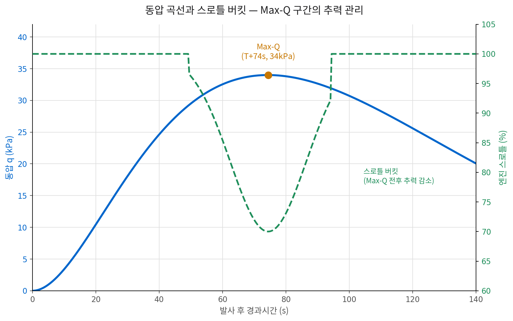
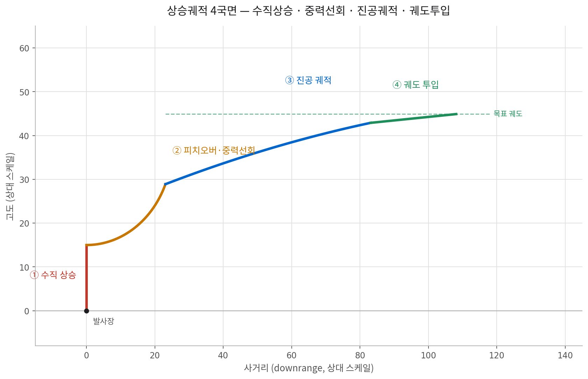

# 4주차 · 발사체 시스템 설계와 운용
### Launch Vehicle Systems Design & Operations — 엔진을 기체에 얹고, 궤도까지 안전하게 올려 보내는 일

> **우주수송정책과 발사체 기술** — Week 04
> 참고: Karabeyoglu, AA284a *Advanced Rocket Propulsion* — Lecture 7: Launch Trajectories, Stanford University · Wertz & Larson, *Space Mission Analysis and Design (SMAD)*
> 서술 구조 참고: [ERAU, *Introduction to Aerospace Flight Vehicles* — "Rockets & Launch Vehicle Performance"](https://eaglepubs.erau.edu/introductiontoaerospaceflightvehicles/chapter/rocket-performance/)

---

## 서론

- 지금까지는 부분을 봤음 (2주차 궤도역학·로켓방정식, 3주차 추진 시스템)
- 이번 주: 그 부분들이 **하나의 시스템으로 묶일 때 생기는 제약과 절충**을 다룸
- 각 부는 앞부분의 결과를 제약조건으로 받음 — 구조가 궤적을 제약하고, 궤적이 제어를 제약하며, 제어가 운용을 제약

| 파트 | 내용 |
|---|---|
| PART I | 구조와 경량화 — 하중·탱크 구조·재료, 구조질량비의 지배력 |
| PART II | 상승궤적 설계 — 중력선회·Max-Q, 제약 속의 최적화 |
| PART III | 항법·유도·제어 — GNC 삼각형, 연성 진동 문제 |
| PART IV | 발사장과 안전 — 입지 조건·비행종단, 나로우주센터의 제약 |
| PART V | 실패에서 배우기 — 4대 사례 유형학, 개발 방식의 선택 |

> **오늘의 한 문장**: 발사체 설계에서 어려운 것은 각 부분을 잘 만드는 일이 아니라, 서로 충돌하는 요구조건들 사이에서 전체 최적점을 찾는 일이다.

## 학습 목표

- [ ] **구조 설계의 제약을 설명한다** — 발사체가 견디는 하중의 종류와 발생 시점, 탱크 구조 방식과 재료 선택의 논리, 구조질량 1%가 탑재량에 미치는 영향
- [ ] **상승궤적이 왜 그 모양인지 안다** — 수직상승 → 중력선회 → 진공궤적 → 투입, 중력손실 최소화와 Qmax·가속도 제약의 충돌, 코스팅·도그레그·에어론치의 목적
- [ ] **GNC의 역할 분담을 구분한다** — 항법·유도·제어가 각각 답하는 질문, 관성항법의 원리와 한계, 폐루프 유도, 슬로싱·굽힘모드·POGO 같은 연성 문제
- [ ] **운용과 안전을 정책으로 연결한다** — 발사장 입지 조건과 나로우주센터의 제약, 비행종단시스템과 낙하예상구역, 실패 사례의 유형학과 개발 방식의 선택

### 발사체는 무엇으로 이루어져 있는가

- 추진은 전체의 한 조각 — 나머지 조각들이 추진 성능을 실제 탑재량으로 바꿔줌

| 서브시스템 | 구성 | 다루는 곳 |
|---|---|---|
| 추진계 | 엔진·터보펌프·추진제 공급·가압계 | 3주차 |
| 구조계 | 탱크·단간부·페어링·분리장치 | Part I |
| 유도항법제어 | 관성항법장치·비행 컴퓨터·구동기 | Part III |
| 전자·전력계 | 배터리·배선·텔레메트리·안전장치 | Part III·IV |
| 지상계 | 발사대·추진제 공급설비·관제·추적 | Part IV |

**시스템 차원의 '예산' — 무엇을 배분하는가, 왜 서로 얽히는가**

- **질량 예산**: 구조·추진·탑재의 질량이 서로 경쟁 — 구조 1 kg을 줄이면 탑재 1 kg이 늘어남(상단 기준)
- **하중 예산**: 각 서브시스템이 견뎌야 할 하중을 배분 — 궤적 설계가 하중을 만들고, 하중이 구조 질량을 만듦
- **전력·열 예산**: 비행 시간 동안의 전력과 열을 배분 — 비행 시간이 길수록 배터리·단열이 무거워짐
- **신뢰도 예산**: 목표 성공률을 부품 단위로 분배 — 부품 수가 늘면 각 부품에 더 높은 신뢰도가 요구됨

> **핵심 개념**: 발사체 설계는 이 '예산'들을 동시에 만족시키는 해를 찾는 일이다. 한 예산을 넉넉히 잡으면 다른 예산이 반드시 부족해진다.

---

## PART I · 구조와 경량화

### 1.1 왜 구조 엔지니어가 1 kg 때문에 싸우는가

- 2주차 로켓방정식에서 질량비는 지수 안에 있었음 → 구조 질량은 그 지수를 직접 갉아먹는 항

$$
\varepsilon = \frac{m_{구조}}{m_{구조} + m_{추진제}} \quad (\text{구조질량비 — 낮을수록 좋지만, 낮출수록 안전여유가 사라진다})
$$

- **감각을 위한 숫자**: 잘 만든 액체 발사체 단의 ε는 0.05~0.09. 추진제 가득 찬 탱크 무게 중 구조는 5~9%뿐 — 음료 캔보다 얇은 벽으로 이 일을 함

| 변화 | 탑재량 영향(경향) | 이유 |
|---|---|---|
| 상단(2단) 구조 1 kg 증가 | 탑재량 약 1 kg 감소 | 상단 질량은 탑재량과 거의 1:1로 경쟁 |
| 1단 구조 1 kg 증가 | 탑재량 약 0.05~0.1 kg 감소 | 1단은 상단 분리 전에 버려지므로 영향이 훨씬 작음 |
| 상단 Isp 1 s 증가 | 탑재량 수 kg~수십 kg 증가 | 그래서 상단은 성능, 1단은 비용·추력이 우선 |

- **그래서 생기는 일**
  - 안전계수(safety factor)를 1.25~1.4까지 낮춰 잡음 — 항공기(1.5)보다도 공격적
  - 1회용 구조는 '한 번만 견디면 된다'는 전제로 설계됨
  - 재사용 구조는 이 전제를 버려야 하므로 더 무거워짐
- **재사용의 구조적 대가**
  - 착륙 다리·격자날개·재진입 보호재가 모두 순수한 추가 질량
  - 회수용 추진제까지 남겨야 하므로 유효 탑재량이 30~40% 감소
  - 5주차 재사용 경제성은 이 손실을 재비행 횟수로 상쇄하는 계산이었음

### 1.2 발사체가 견디는 하중 — 언제, 어떤 힘이 오는가

- 구조 설계는 '가장 센 힘'이 아니라 **'언제 어떤 조합으로 오는가'**의 문제
- 최대 하중은 대개 비행 초반 90초 안에 몰려 있음

| 국면 | 시점 | 지배 하중 | 설계·운용상의 대응 |
|---|---|---|---|
| 지상 대기·이송 | T−수시간 | 자중, 바람에 의한 굽힘, 수송 진동 | 빈 기체가 오히려 취약 → 탱크를 가압해 세워 둠 |
| 이륙·상승 초기 | T+0~40s | 엔진 추력에 의한 축압축, 음향하중(140dB↑) | 발사대 화염유도로와 살수(음향 억제) |
| 최대 동압(Max-Q) | T+60~80s | 동압 30~35kPa + 받음각에 의한 굽힘 | 구조 하중이 가장 가혹한 구간 — 스로틀 감소 |
| 연소 종료 직전 | MECO 직전 | 기체가 가벼워져 축가속도 최대(3~4g) | 탑재체 보호를 위해 추력을 낮추는 경우 많음 |
| 단분리·페어링 분리 | 각 이벤트 | 충격(pyroshock), 순간 비대칭 하중 | 충격이 전자장비에 전달되지 않도록 절연 설계 |

**Max-Q — 왜 여기가 최악인가**

$$
q = \tfrac{1}{2}\rho V^2
$$

- 속도는 계속 커지고 밀도는 계속 작아짐 → 두 곡선의 곱이 최대가 되는 지점이 Max-Q
- 이때 기체가 바람에 조금만 기울어도 옆방향 굽힘이 급증

- **스로틀 버킷(throttle bucket)**
  - Max-Q 직전에 엔진 추력을 의도적으로 낮췄다가 통과 후 다시 올림
  - 성능(중력손실)을 조금 희생해 구조 하중을 낮추는 거래
  - 구조를 두껍게 하는 대신 궤적으로 하중을 관리하는 대표적 예 — Part II와 직결

### 1.3 탱크를 어떻게 만들 것인가 — 네 가지 계보

- 발사체 부피의 대부분은 추진제 탱크 → 탱크를 가볍게 만드는 방식이 곧 발사체의 성격을 결정

| 방식 | 원리 | 장점 | 단점 |
|---|---|---|---|
| 스킨-스트링거 | 얇은 외피에 세로 보강재(스트링거)와 원형 프레임을 붙임(항공기 동체와 같은 사고방식) | 가장 보편적·제작 노하우 축적 용이 | 부품 수와 리벳·용접 지점이 많음 |
| 등격자(Isogrid) | 두꺼운 판을 삼각 격자만 남기고 깎아냄(보강재와 외피가 한 덩어리) | 가볍고 강함·접합부 없음 | 가공 시간이 길고 재료 낭비가 큼 |
| 공통격벽 | 연료·산화제 탱크 사이 격벽을 하나로 공유해 기체 길이를 줄임 | 길이·질량 동시 절감 | 격벽 양쪽의 온도차 단열이 난제 |
| 압력안정형(풍선탱크) | 얇은 외피를 내부 압력으로 팽팽하게 유지해 형상을 잡음(보강재 거의 없음) | 구조질량비 극한까지 절감 | 가압 없이는 자립 불가 — 지상 취급이 까다로움 |

> **읽는 법**: 아래로 갈수록 구조는 가벼워지지만 취급은 까다로워진다. 다빈도 발사에서는 '지상에서 다루기 쉬운가'가 구조질량비만큼 중요한 기준이 된다.

### 1.4 재료 선택 — 가벼운 것이 항상 정답은 아니다

- 비강도만 보면 복합재가 압도적 → 그런데 현장의 선택은 그렇게 단순하지 않음

| 재료 | 강점 | 약점 | 주요 적용 |
|---|---|---|---|
| 알루미늄 합금 | 가공·용접 노하우 최다, 저온 강도 유지 | 비강도가 최고는 아님 | 다수 발사체의 표준 |
| 알루미늄-리튬(Al-Li) | 알루미늄 대비 밀도 낮고 강성 높음 | 가격이 비싸고 가공 까다로움 | STS 외부탱크, Falcon 9 |
| 탄소섬유 복합재 | 비강도 최고·페어링·단간부에 유리 | 극저온 추진제 탱크는 미세균열·투과 문제 | 페어링·고체 케이스 |
| 스테인리스강 | 고온 강도 우수·저렴·야외 용접 가능 | 밀도가 높아 무거움 | Starship — 재진입 발열을 재료로 버티는 전략 |

- **스테인리스강의 역설**
  - 밀도로만 보면 알루미늄의 약 3배 — 명백히 불리한 선택
  - 그러나 재진입 온도에서도 강도를 유지 → 열보호재를 크게 줄일 수 있음
  - 야외 용접·제작 가능 → 대형 구조물의 제조 단가·공기가 급감
  - 재료 선택이 '가장 가벼운 것'이 아니라 **'전체 시스템에서 가장 싼 것'**으로 이동한 사례
- **복합재가 탱크에서 고전하는 이유**
  - 극저온에서 수지·섬유의 수축률이 달라 미세균열 발생 → 액체수소가 새어 나감
  - 손상 여부를 눈으로 확인 불가 → 비파괴검사 비용이 큼
  - 그래서 압력을 덜 받는 페어링·단간부·고체모터 케이스에 먼저 자리 잡음
  - 다만 최근 극저온 복합재 탱크의 실용화 시도가 다시 활발

### 1.5 페어링과 분리장치 — 가장 단순해 보이는 곳이 가장 자주 실패한다

- 추력도, 방향도 잡지 않는 부품이지만 발사 실패 원인 목록에서는 상위권

- **페어링의 임무**
  - 대기권 통과 중 탑재체를 공력·음향·열로부터 보호
  - 대기가 희박해지는 시점(고도 100 km 내외)에 분리
  - 분리가 이를수록 질량 이득 — 그러나 탑재체 가열 위험
- **왜 어려운가**
  - 단 한 번, 진공에서, 되돌릴 수 없이 작동해야 함
  - 지상에서 완벽한 환경 재현 불가능
  - 두 짝이 동시에 떨어져야 하며, 한쪽만 남으면 임무 실패

> **국내 사례**: 나로호 1차 발사(2009)에서 페어링 한쪽이 분리되지 않아 위성이 궤도에 오르지 못했다. 추진계는 정상 작동했음에도 임무는 실패했다.

| 분리 이벤트 | 대표 방식 | 설계상의 관건 |
|---|---|---|
| 단분리 | 폭발볼트·절단코드·클램프밴드 | 충격이 크지만 확실·잔여추력에 의한 재접촉 위험 |
| 페어링 분리 | 세로 절단 후 힌지 회전 또는 밀어내기 | 두 짝의 동시성 확보가 핵심 |
| 탑재체 분리 | 스프링 방출·저충격 분리장치 | 회전(텀블링) 없이 떠나보내야 함 |
| 재점화 대비 | 얼리지 모터로 추진제를 탱크 바닥에 안착 | 무추력 구간 후 재점화 실패를 막는 장치 |

> **공통점**: 이들은 모두 '한 번만, 되돌릴 수 없이' 작동하는 이벤트다. 지상 시험으로 확인할 수 있는 범위가 좁아 설계 여유와 이중화가 유일한 방어책이 된다.

---

## PART II · 상승궤적 설계

### 2.1 상승궤적은 왜 이런 모양인가 — 네 국면

- 수직으로 쏘아 올려 옆으로 눕힌다 — 이 단순한 문장 안에 발사체 설계의 절반이 들어 있음

1. **수직 상승**: 대기의 조밀한 층을 최단거리로 빠져나감. 궤적각이 커서 중력손실이 크지만, 동압·공력하중을 줄이기 위해 감수
2. **피치오버·중력선회**: 약간 기울여 준 뒤에는 중력이 알아서 기체를 눕힘. 받음각을 0에 가깝게 유지해 옆방향 굽힘하중을 없앰
3. **진공 궤적**: 대기를 벗어나면 항력 제약이 사라짐. 이제부터는 수평 방향 가속에 집중해 궤도속도를 만듦
4. **궤도 투입**: 목표 고도에서 궤적각 0°, 궤도속도 도달. 많은 경우 주차궤도에 넣은 뒤 원지점에서 다시 점화해 원궤도화

> **중력선회(gravity turn)의 묘미**: 초기에 살짝 기울여 주면, 이후에는 조종 없이도 중력이 속도벡터를 서서히 수평으로 돌려준다. 기체를 억지로 꺾지 않으므로 받음각이 0에 가깝게 유지되고, 옆방향 하중이 생기지 않는다 — 구조를 가장 가볍게 만들 수 있는 비행경로다.

### 2.2 궤적으로 바꿀 수 있는 것은 사실상 하나뿐이다

- 2주차의 Δv 예산을 다시 펼쳐 보자. 네 항 중 설계자가 손댈 수 있는 항이 어느 것인지가 이번 파트의 출발점

| Δv 구성 요소 | 대표값 | 궤적으로 조절? | 설명 |
|---|---|---|---|
| 궤도속도 | ≈ 7.67 km/s | 불가 | 목표 궤도가 정해지면 물리적으로 결정 |
| 위치에너지 항 | ≈ 0.47 km/s | 불가 | 고도를 올리는 데 드는 몫 — 가역적이며 궤도가 정함 |
| **중력손실** | ≈ 2.2 km/s | **가능** | 비행경로에 따라 달라지는 비가역 손실 — 유일한 조절 대상 |
| 항력손실 | ≈ 0.1 km/s | 제한적 | 전체의 1% 수준이라 최적화 효과가 작음 |
| **합계** | **≈ 10.44 km/s** | | 고도 400km·극궤도(자전 이득 없음) 기준 |

**중력손실이란 무엇인가**

$$
\Delta v_{grav} = \int g \sin\gamma \, dt
$$

- 엔진이 낸 추력 중 중력을 거스르는 데 쓰여 사라지는 몫
- 궤적각 γ가 클수록(수직에 가까울수록), 그리고 그 상태로 오래 있을수록 손실이 커짐
- 고도를 얻는 데 쓴 위치에너지와는 다른, 되돌릴 수 없는 손실

- **지구 자전이라는 공짜 Δv**
  - 적도에서 지표면은 동쪽으로 약 465 m/s로 돌고 있음
  - 위도 φ에서의 이득 ≈ 465·cos φ (동쪽으로 쏠 때)
  - 경사각 40° 궤도로 동향 발사 시 약 0.36 km/s 절감 — 전체의 3.5%
  - 반대로 서향(역행) 궤도는 같은 크기만큼 손해

### 2.3 중력손실을 줄이는 두 방법과 그 대가

- 이론적으로 답은 명확함 — 문제는 그 답이 현실의 모든 제약을 동시에 위반한다는 것

- **A. 가능한 한 빨리 태운다**
  - 연소 시간이 짧을수록 ∫g·sinγ dt가 작아짐. 극단적으로는 순간 충격량이 이상적
  - **대가**: 가속도가 탑재체 허용치를 넘고, 동압이 구조 한계를 넘음. 유량이 커져 밸브·배관·노즐이 무거워지므로 구조질량비도 나빠짐
- **B. 가능한 한 빨리 수평으로 눕힌다**
  - sin γ가 작아지면 손실이 줄어듦. 지면과 나란히 가속하는 것이 이상적
  - **대가**: 대기가 있는 한 불가능. 저고도에서 수평 가속하면 동압과 공력가열이 폭증하고, 지형도 넘어야 함

> **결론**: 궤적 설계는 '중력손실 최소화'라는 목적함수를 최대가속도·최대동압·공력가열·낙하구역이라는 부등식 제약 아래에서 푸는 최적제어 문제다. 제약이 없다면 답은 자명하고, 제약이 있어서 어렵다.

| 제약조건 | 대표 수준 | 설계·운용상의 의미 |
|---|---|---|
| 최대 가속도 | 3~5 g 수준 | 탑재체·구조 보호 → 연소 후반 스로틀 다운으로 대응 |
| 최대 동압(Qmax) | 30~35 kPa 수준 | 구조 굽힘하중 제한 → 스로틀 버킷·궤적각 조정으로 대응 |
| 공력 가열 | 정체점 열유속 상한 | 페어링 분리 시점을 결정하는 조건 |
| 낙하 예상구역 | 1·2단과 페어링의 낙하점 | 발사 방위각을 직접 구속 — Part IV와 직결 |
| 가시권·통신 | 지상국 추적 가능 구간 | 안전 판단과 텔레메트리 확보를 위한 조건 |

### 2.4 실제로는 어떻게 푸는가 — 궤적 적분

- 중력손실과 항력손실은 궤적에 따라 달라지고, 궤적은 다시 그 손실에 따라 달라짐 → 손으로 풀 수 없어 수치적분

| 구분 | 내용 |
|---|---|
| 상태변수(State) | 속도 V · 궤적각 γ(지평선 기준) · 고도 y · 사거리 x · 기체 질량 M |
| 작용하는 힘 | 추력 T(추진 모듈에서 입력) · 항력 D, 양력 L · 중력 (D·L은 순간 동압과 받음각으로 계산) |
| 입력변수(제어) | 추력벡터제어 각도 · 추력 프로파일(스로틀) · 받음각(대기권 구간) → 이것이 '설계 자유도' |

- **적분의 시작과 끝**
  - 시작 — 발사대에서의 초기 조건(속도 0, 궤적각 90°, 고도 0, 전체 질량)
  - 종료 조건 — 목표 고도에서 궤도속도 도달, 궤적각 0°, 추진제 소진
  - 이 네 조건을 동시에 만족시키는 제어 입력을 찾는 것이 궤적 설계 → 한 번에 맞지 않아 반복 계산
- **간단한 모델도 쓸모가 있다**
  - 예비 설계 단계에서는 항력계수를 마하수의 간단한 함수로 두는 근사 모형으로 충분
  - 항력손실이 전체의 1% 수준이므로, 정밀도를 높여도 총 Δv는 거의 변하지 않음
  - 반대로 중력손실은 궤적에 민감하므로 여기에 계산 자원을 집중
  - 정책·기획 단계의 성능 추정에는 이 정도 근사로도 충분한 판단 근거가 나옴

### 2.5 어느 방향으로 쏠 것인가 — 방위각과 도그레그

- 발사장의 위도와 쏠 수 있는 방향이 도달 가능한 궤도를 결정 — 지리가 곧 성능

$$
\cos i = \cos\phi \cdot \sin\beta
$$

$i$: 궤도 경사각 / $\phi$: 발사장 위도 / $\beta$: 발사 방위각

> **철칙**: 발사장 위도보다 낮은 경사각의 궤도에는 직접 갈 수 없다. 적도 궤도에 가장 유리한 곳은 적도 근처 발사장이다.

| 발사 방식 | 도달 경사각 | 자전 효과 | 비고 |
|---|---|---|---|
| 동향 발사(β=90°) | 경사각 = 발사장 위도 | 지구 자전 이득 최대 | 적도 부근일수록 유리 |
| 극궤도(β≈180° 또는 0°) | 경사각 ≈ 90° | 자전 이득 없음 | SSO·정찰 임무의 표준 |
| 역행 궤도(서향) | 경사각 > 90° | 자전만큼 손해 | 일부 SSO가 여기 해당 |
| 도그레그 기동 | 비행 중 방위각을 꺾음 | Δv 손실 발생 | 낙하구역·영공 회피를 위해 성능을 지불 |

- **도그레그(dog-leg)란**: 원하는 경사각으로 곧장 갈 수 없을 때, 일단 안전한 방향으로 쏜 뒤 비행 중 방위각을 꺾는 기동. 속도벡터를 옆으로 돌리는 데 Δv를 쓰므로 탑재량이 줄어듦
- **정책적 함의**: 도그레그 손실은 기술로 없앨 수 없다. 발사장 입지, 즉 지리·외교·안전 규제가 발사체 성능을 직접 깎는다 — 순수한 정책 변수다

### 2.6 성능을 더 짜내는 두 가지 방법

**코스팅(Coasting) — 잠시 엔진을 끈다**

- 단 연소 사이에 추력 없이 관성 비행하는 구간을 둠
- 고도를 벌어 두면 이후 연소의 궤적각이 낮아져 중력손실이 줄어듦
- 고도를 속도와 맞바꾸는 셈 — 에너지는 보존됨
- 고고도 궤도(GTO 등)일수록 효과가 큼
- 대신 재점화 신뢰성과 얼리지 처리가 전제 조건(3주차)

**에어론치 — 비행기에서 쏜다**

- 고도 10 km 부근에서 분리하므로 공기밀도가 낮음
- 동압·가열 제약이 완화되어 궤적을 더 공격적으로 눕힐 수 있음
- 기압이 낮아 큰 팽창비 노즐을 1단부터 쓸 수 있음 → Isp 이득
- 발사 위치를 옮길 수 있어 경사각 선택과 안전 확보가 자유로움
- 아음속 모기 기준 Δv 이득은 10% 안팎

| 에어론치의 한계 | 내용 | 함의 |
|---|---|---|
| 모기(母機) 비용 | 전용기 개발은 발사체 개발에 맞먹는 비용 | 기존 기체를 쓰면 중량·형상 제약이 커짐 |
| 규모의 한계 | 항공기가 실을 수 있는 질량이 곧 발사체 상한 | 소형 발사체 영역을 벗어나기 어려움 |
| 고정비 구조 | 항공기 운용·정비는 고정비가 큼 | 발사 빈도가 낮으면 회당 비용이 급등 |
| 시장 결과 | 여러 시도가 있었으나 상업적 지속은 제한적 | 12주차 소형발사체 생태계 논의로 연결 |

> **정리**: 궤적 설계로 얻는 성능 개선은 대개 수 %대다. 그러나 발사체 사업에서 탑재량 5%는 사업 타당성을 뒤집을 수 있는 크기다.

---

## PART III · 항법 · 유도 · 제어

### 3.1 GNC — 세 가지 다른 질문

- 흔히 뭉뚱그려 '유도제어'라 부르지만, 실제로는 서로 다른 세 질문에 답하는 세 개의 기능

| 기능 | 질문 | 수단 | 출력 |
|---|---|---|---|
| 항법(Navigation) | "나는 지금 어디에, 어떤 속도로 있는가?" | 관성센서·위성항법·지상 추적 레이더 | 현재 상태 추정치 |
| 유도(Guidance) | "목표에 닿으려면 어디로 가야 하는가?" | 비행 컴퓨터의 유도 알고리즘 | 요구 자세·추력 명령 |
| 제어(Control) | "그 명령을 어떻게 실현하는가?" | 짐벌 구동기·자세 제어기·필터 | 구동기 각도·추력 조절 |

- **피드백**: 제어의 결과가 다시 항법의 입력이 됨(초당 수십~수백 회 반복)

| 관점 | 항법 | 유도 | 제어 |
|---|---|---|---|
| 오류가 나면 | 위치 추정이 틀림 | 잘못된 목표로 향함 | 명령대로 움직이지 못함 |
| 대표 고장 | 센서 드리프트·정렬 오류 | 알고리즘 예외 상황 미처리 | 구동기 고장·진동 발산 |
| 방어 수단 | 다중 센서 융합·이중화 | 비행 전 광범위한 시나리오 검증 | 필터 설계·여유 위상 확보 |

### 3.2 항법 — 밖을 보지 않고 위치를 아는 법

- 발사체의 기본 항법은 관성항법 — 외부 신호 없이도 작동한다는 점이 장점이자 한계

- **관성항법(INS)의 원리**
  - 가속도계가 가속도를, 자이로가 회전을 잼
  - 가속도를 한 번 적분하면 속도, 두 번 적분하면 위치
  - 출발점의 위치와 자세를 정확히 알아야 함 → 발사 전 '정렬(alignment)' 작업
  - 외부 신호에 의존하지 않아 전파방해에 강함 — 이중용도 기술로 분류되는 이유
- **적분이 낳는 문제**
  - 센서의 작은 편향(bias)이 적분되며 시간에 따라 오차가 누적 — 드리프트
  - 비행 시간이 길수록 오차가 커지므로, 정밀도 요구는 임무 시간에 비례
  - 그래서 위성항법(GNSS) 수신값과 융합해 드리프트를 주기적으로 보정
  - 융합에는 칼만 필터 계열이 표준적으로 쓰임

| 구현 방식 | 원리 | 특징 |
|---|---|---|
| 짐벌형(Gimbaled) | 기계적 짐벌 위에 센서를 띄워 관성 좌표계를 물리적으로 유지 | 정밀하지만 무겁고 비싸며 기계적 고장점이 많음 |
| 스트랩다운(Strapdown) | 센서를 기체에 고정하고 좌표 변환을 계산으로 처리 | 현대 표준 — 연산 부담을 소프트웨어가 흡수 |
| 광섬유·링레이저 자이로 | 회전을 광학적으로 측정, 기계적 마모 없음 | 발사체·미사일 등급의 주력 센서 |
| MEMS 관성센서 | 반도체 공정으로 대량 생산, 매우 저렴 | 정밀도가 낮아 GNSS 보정과 결합해 소형 발사체에 활용 |

> **정책 메모**: 고정밀 관성항법장치는 탄도미사일의 핵심 부품이기도 하다. MTCR과 수출통제 목록에서 항법장치가 엔진·구조와 나란히 다뤄지는 이유이며, 7주차에서 상세히 다룬다.

### 3.3 유도 — 정해진 길을 갈 것인가, 다시 계산할 것인가

- 같은 발사체라도 유도 방식에 따라 이상 상황에서의 생존 능력이 완전히 달라짐

- **개루프 유도(사전 계획 궤적)**: 지상에서 미리 계산한 자세 명령을 시간에 따라 그대로 따라감
  - 장점 — 연산이 가볍고 검증이 쉬움. 대기권 구간에서는 하중 관리를 위해 오히려 이 방식이 적합
  - 한계 — 성능 편차나 외란이 생기면 그만큼의 오차가 그대로 누적
- **폐루프 유도(실시간 재계산)**: 현재 상태에서 목표 궤도까지의 최적 경로를 매 주기 다시 풂
  - 장점 — 엔진 성능 부족이나 조기 종료 같은 이상에도 남은 추진제로 최선의 궤도를 찾아감
  - 대표 계열 — 새턴 V의 반복 유도 방식, 우주왕복선 계열의 명시적 유도(PEG) 등

| 비행 구간 | 주로 쓰는 방식 | 이유 |
|---|---|---|
| 대기권 상승 | 개루프 중심 | 받음각을 0에 가깝게 유지하는 것이 최우선 — 하중 관리가 성능보다 앞섬 |
| 진공 구간 | 폐루프 | 항력 제약이 사라지므로 목표 궤도를 향한 최적 자세를 실시간으로 계산 |
| 궤도 투입 직전 | 폐루프+종료 조건 판정 | 정확한 시점에 엔진을 끄는 것이 궤도 정밀도를 결정 |
| 이상 발생 시 | 폐루프의 진가 | 성능 부족 시 목표를 낮춘 궤도로 자동 조정 — 임무 전부를 잃지 않음 |

### 3.4 제어 — 흔들리는 것들과의 싸움

- 발사체는 강체가 아님 — 휘어지고, 안에서 액체가 출렁이며, 엔진과 배관이 서로를 흔듦

| 연성 진동 문제 | 현상 | 대응 |
|---|---|---|
| 구조 굽힘 모드 | 긴 원통형 기체는 낚싯대처럼 휨. 자이로가 이 진동을 자세 변화로 오인하고 구동기를 움직이면, 그 움직임이 진동을 더 키움 | 진동 주파수를 걸러내는 노치 필터·센서 위치 최적화 |
| 추진제 슬로싱 | 탱크 안 액체가 출렁이며 무게중심을 흔듦. 탱크가 절반쯤 비었을 때 가장 심함 | 탱크 내부 배플(칸막이) 설치·슬로싱 모드를 모델에 포함 |
| POGO 진동 | 추력 변동→구조 진동→추진제 공급 압력 변동→다시 추력 변동. 추진계와 구조가 만드는 폐루프 | 공급 배관에 축압기(accumulator)를 달아 압력 진동을 흡수 |

- **왜 시뮬레이션만으로는 부족한가**
  - 굽힘 주파수는 추진제가 소모되며 비행 내내 변함 — 고정된 필터로는 부족
  - 지상에서 기체 전체의 진동 특성을 재현하려면 대형 모달 시험 설비가 필요
  - 그래서 첫 비행의 계측 데이터가 무엇보다 값짐

> **핵심 통찰**: 이 세 문제의 공통점은 서브시스템 각각은 정상인데 결합했을 때만 나타난다는 것이다. 구조팀·추진팀·제어팀이 각자 최적화하면 오히려 놓치기 쉬운 영역 — 시스템 공학이 존재하는 이유다.

### 3.5 재사용이 GNC에 요구한 것 — 착륙 유도

- 올라가는 유도는 목표가 넓음(궤도는 하나의 곡선). 내려오는 유도는 목표가 좁음(정해진 지점, 정해진 속도, 정해진 자세)

| 비교 항목 | 상승 유도 | 착륙 유도 |
|---|---|---|
| 목표의 성격 | 궤도 요소를 만족하면 됨 — 여유가 있음 | 지정 지점·속도≈0·수직 자세 동시 만족 |
| 추진제 여유 | 설계 단계에서 확보 | 회수용 잔량만으로 해결 — 실패 시 재시도 불가 |
| 연산 시간 | 비교적 여유 | 수십 초 안에 수백 회 재계산 |
| 외란 | 상층 바람 정도 | 재진입 가열·돌풍·해상 플랫폼의 움직임 |
| 실패의 결과 | 궤도 정밀도 저하 | 기체 손실 — 다만 임무 자체는 이미 완수 |

- **무엇이 이를 가능하게 했나**
  - 연료 최소 착륙 문제를 실시간으로 풀 수 있는 최적화 기법의 발전
  - 탑재 컴퓨터의 연산 능력 향상 — 지상에서 며칠 걸리던 계산이 기내에서 초 단위로
  - 깊은 스로틀링과 확실한 재점화가 가능한 엔진(3주차)
  - 격자날개 등 대기권 내 조종면의 실용화
- **정책·산업적 의미**
  - 재사용은 '큰 기술 하나'가 아니라 엔진·구조·GNC·지상운용의 동시 성숙이 필요한 시스템 역량
  - 특정 부품을 도입한다고 확보되지 않으며, 통합 경험이 진입장벽
  - 국내 차세대발사체가 재사용 전환 시 GNC·착륙 실증을 별도 단계로 두는 이유

---

## PART IV · 발사장과 안전

### 4.1 발사장은 어디에 지어야 하는가

- 발사장 입지는 공학 문제로 시작해 외교·안전·주민수용성 문제로 끝남

| 고려 요소 | 내용 |
|---|---|
| 위도 | 적도에 가까울수록 지구 자전 이득이 크고, 낮은 경사각 궤도에 직접 갈 수 있음 |
| 발사 가능 방위각 | 낙하물이 해상에 떨어지고 타국 영공(고도 100km 이하)을 지나지 않아야 함 |
| 인구 분포 | 비행경로 아래에 인구밀집지역이 없어야 하며, 발사대 주변 안전구역도 필요 |
| 기상·물류 | 태풍·낙뢰 빈도, 대형 기체 운송로(항만·도로), 추진제 조달 여건 |
| 추적·통신 | 상승 전 구간을 추적할 지상국 또는 해외 추적소 확보 |

- **한국의 선택 과정**
  - 공학적 평가에서는 제주 남단이 발사 가능 방위각 측면에서 최고점을 받음
  - 그러나 주민 수용성 문제로 무산되고 전남 고흥(외나로도)이 선정됨
  - 입지 선정은 최적화 문제가 아니라 **수용성이 걸린 정치 과정**임을 보여주는 사례
  - 발사장 입지의 제약은 이후 수십 년간 발사체 성능을 구속함 — 되돌릴 수 없는 결정
- **왜 정책 문제인가**
  - 타국 영공 회피는 국제법·외교 협의의 영역
  - 어업권·항행 안전 협의가 발사 가능 시기를 제한할 수 있음
  - 민간 발사 개방은 발사장을 '연구시설'에서 '기반 인프라'로 재정의하는 일 — 사용료·우선순위·배상책임 제도가 함께 필요(7주차)

### 4.2 세계 주요 발사장과 나로우주센터의 조건

- 위도와 쏠 수 있는 방향만 비교해도 각 발사장이 어떤 궤도에 특화되는지가 드러남

| 발사장 | 국가 | 위도 | 발사 가능 방향 | 특화 궤도 | 비고 |
|---|---|---|---|---|---|
| 기아나(쿠루) | 프랑스령 | ≈5.2°N | 동측 대서양 | 정지궤도에 최적 | 적도 근접 — 자전 이득 최대 |
| 케이프커내버럴/KSC | 미국 | ≈28.5°N | 동측 대서양 | 저경사각~중경사각 | 미국의 주력 상업·유인 발사장 |
| 반덴버그 | 미국 | ≈34.7°N | 남측 태평양 | 극궤도·SSO 전용 | 동향 발사 불가 — 임무 특화 |
| 바이코누르 | 카자흐스탄(러 임차) | ≈45.6°N | 내륙 | 낙하물이 육상에 | 위도가 높아 자전 이득이 작음 |
| 다네가시마 | 일본 | ≈30.4°N | 동측 태평양 | 정지궤도·저궤도 | 과거 어업 협정으로 발사 시기 제약 |
| 나로우주센터 | 대한민국 | ≈34.4°N | 남측만(방위각≈170°) | 극궤도·SSO | 동측 일본 — 자전 이득 활용 곤란 |

**누리호가 치르는 비용**

- 방위각 약 170°(남남동)로 제주와 규슈 사이 해역을 통과
- 1·2단은 그 직선상 해상에 낙하, 3단에서 태양동기궤도로 꺾음
- 이 도그레그는 순수한 성능 손실 — 낙하 안전과 영공 회피의 대가
- 동향 발사 불가로 자전 이득(위도 34°에서 약 385 m/s)을 못 씀

**인프라 확충 방향(2026년 기준)**

- 나로우주센터: 노후 시설 보강과 차세대발사체 운용 기반 강화
- 민간 발사장: 나로우주센터 인근에 조성 중, 이용 가이드라인 마련
- 제2우주센터: 재사용발사체 발사·착륙·시험 전용 인프라로 구상
- 즉 '한 발사장 다목적'에서 **'역할 분담형 다발사장 체계'**로 이동

### 4.3 비행 안전 — 실패를 전제로 설계하는 체계

- 발사체는 실패할 수 있음. 안전 체계의 목적은 실패를 없애는 것이 아니라, **실패가 제3자에게 미치는 피해를 통제**하는 것

**핵심 개념 — 순간낙하예상점(IIP)**

- '지금 이 순간 추력이 사라지면 잔해가 어디에 떨어지는가'를 실시간으로 계산한 점
- 이 점이 허용된 구역(해상 등)을 벗어나면 비행을 중단시킴
- 허용 구역은 인구·항로·항행선박·타국 영토를 고려해 사전에 설정
- 발사 방위각과 궤적이 이 구역에 의해 사실상 결정됨 — Part II와 직결

**비행종단시스템(FTS)**

- 이상 시 추진을 정지시키거나 기체를 파괴해 잔해를 예정 구역 안에 떨어뜨리는 장치
- 전통 방식: 지상 안전관이 판단해 무선 명령을 보냄 — 통신 지연과 인적 판단이 개입
- 자율형(AFTS): 탑재 컴퓨터가 스스로 규칙을 판정해 종단 — 지상 추적 자산 부담이 크게 줄어듦
- 자율화는 발사 빈도를 높이는 핵심 인프라 혁신으로 평가됨

| 운용 요소 | 내용 | 함의 |
|---|---|---|
| 발사 윈도우 | 궤도면·조명·지상국 가시성 조건이 겹치는 시간대 | SSO는 하루 수 분, 랑데부 임무는 순간 윈도우인 경우도 있음 |
| 해상·공역 통제 | 낙하 예상 구역의 선박·항공기 통제 | 관계 기관 협의와 사전 공지(NOTAM 등)가 필요 |
| 카운트다운 홀드 | 이상 징후 시 카운트다운을 멈추고 판정 | 윈도우 안에 재개하지 못하면 발사 연기 |
| 발사 후 조치 | 잔해 회수, 데이터 확보, 사고 조사 절차 | 민간 발사에서는 배상책임·보험과 직결(7주차) |

> **정책적 함의**: 비행 안전은 기술 규격인 동시에 인허가 요건이다. 안전 기준이 지나치게 보수적이면 발사 빈도가 억제되고, 지나치게 느슨하면 사고 한 번으로 산업 전체가 멈춘다. 이 균형이 7주차의 핵심 논점이다.

### 4.4 발사 운용 — 회당 비용의 절반은 여기서 결정된다

- 기체를 잘 만드는 것과 자주 쏘는 것은 다른 문제 — 운용 설계가 곧 비용 구조

| 단계 | 소요 기간 | 내용 |
|---|---|---|
| 기체 반입·조립 | 수 주 | 단별 반입 후 수평 또는 수직 조립 |
| 기능 시험·점검 | 수 일 | 전기·유압·통신 계통 종합 점검 |
| 발사대 이송·기립 | 1일 | 이렉터 또는 이동식 구조물 |
| 카운트다운 | 수 시간 | 추진제 충전·최종 점검·종단 판정 |
| 발사 후 복구 | 수 일~수 주 | 발사대 세척·수리, 데이터 분석 |

- 일회용 발사체의 캠페인은 통상 수 주에서 수 개월. 이 시간을 줄이는 것이 다빈도 발사의 실질적 과제

| 운용 설계 변수 | 내용 | 비용·발사율에 미치는 영향 |
|---|---|---|
| 수평 조립+이렉터 | 지상에서 눕혀 조립 후 세움 | 건물 높이가 낮아 시설비가 싸고 작업이 빠름 |
| 수직 조립(VAB형) | 전용 조립동에서 세운 채 조립 | 대형 기체·유인 임무에 유리하나 시설비가 큼 |
| 발사대 수와 병렬성 | 한 발사대의 복구 시간이 발사율 상한을 만듦 | 발사율을 늘리려면 발사대를 늘리거나 복구를 빠르게 |
| 자동화 수준 | 충전·점검·판정의 자동화 비율 | 인력 규모와 카운트다운 시간을 직접 좌우 |

> **연결**: 12주차에서 다룰 발사 가격은 기체 제작비만이 아니라 이 운용 구조에서 결정된다. 팀 사업기획보고서의 원가 모형에도 운용비 항목이 반드시 들어가야 한다.

---

## PART V · 실패에서 배우기

### 5.1 발사체는 어떻게 신뢰성을 얻는가

- 신규 발사체의 초기 실패율은 높고, 비행 횟수가 쌓이면서 내려감 — 이 곡선의 모양이 개발 전략을 결정

- **이 곡선이 말하는 것**
  - 초기 실패는 예외가 아니라 통계적으로 예상되는 사건
  - 설계 결함은 대부분 초기 몇 회에서 드러나고, 이후에는 제조·공정 편차가 주된 원인이 됨
  - 따라서 '무결점 첫 발사'를 목표로 삼으면 검증 비용이 폭증하고, '빨리 쏘고 고친다'를 택하면 초기 실패를 감수해야 함
  - 어느 쪽이 옳은지는 기술이 아니라 그 사회가 실패를 어떻게 다루는가에 달려 있음

| 실패 원인 유형 | 구체적 양상 | 주로 나타나는 시기 | 주된 방어 수단 |
|---|---|---|---|
| 설계 결함 | 요구조건 오해·해석 모델의 한계·미검증 조건 | 초기 비행에 집중 | 설계 검토·지상 시험·비행 실증 |
| 제조·공정 편차 | 용접 불량·이물·조립 오류 | 전 기간에 걸쳐 발생 | 공정 관리·검사·이력 추적 |
| 소프트웨어 | 예외 상황 미처리·재사용 코드의 전제 불일치 | 초기 및 개조 시 | 형상 관리·통합 시뮬레이션 |
| 운용 오류 | 절차 위반·배선 오결선·판단 착오 | 전 기간 | 절차 표준화·이중 확인·자동화 |

> ※ 신뢰성 성장 곡선은 개념적 설명이며 특정 발사체의 실제 통계가 아니다.

### 5.2 네 개의 사례, 네 개의 다른 교훈

- 모두 '로켓이 실패했다'로 요약되지만, 실패가 시작된 지점은 전혀 다름

**Ariane 5 첫 비행(1996) — 소프트웨어·재사용의 함정**

- 이전 기체용으로 검증된 관성기준장치 소프트웨어를 그대로 가져옴
- 새 기체의 더 큰 수평 가속도 값이 변환 과정에서 처리 범위를 넘었고, 이중화된 두 장치가 같은 이유로 동시에 정지
- 잘못된 자세 명령이 나가며 기체가 분해됨
- **교훈**: 검증된 부품도 전제조건이 바뀌면 미검증 부품이다. 이중화는 같은 원인에는 무력하다

**Falcon 1 3차(2008) — 설계 변경의 파급**

- 1단 엔진을 냉각 방식이 다른 신형으로 바꾸면서 연소 종료 후 남는 잔여 추력의 양상이 달라짐
- 기존 분리 시퀀스를 그대로 쓴 결과 1단이 2단을 따라가 접촉
- **교훈**: 부품 하나를 바꾸면 그 부품과 맞물린 시퀀스 전체를 다시 검토해야 한다

**Vega 17차(2020) — 제조·조립 단계의 인적 오류**

- 상단 자세제어 구동기의 케이블이 설계와 반대로 연결됨
- 제어 명령이 반대 방향으로 작동해 기체가 궤도를 벗어남 — 설계는 옳았고 부품도 정상이었음
- **교훈**: 설계 품질과 제조 품질은 별개의 문제다. 조립 공정의 오류 방지 설계(포카요케)가 필요하다

**누리호 1차(2021) — 예측하지 못한 비행 환경**

- 3단 산화제 탱크 내부 헬륨탱크의 고정 장치가 비행 중 부력·진동 환경에서 이탈해 탱크가 손상
- 3단 엔진이 목표보다 일찍 연소를 끝내 궤도속도에 도달하지 못함
- **교훈**: 지상에서 재현하기 어려운 비행 환경이 존재한다. 첫 비행의 계측 데이터가 그래서 값지다

> **공통점**: 네 사례 모두 개별 부품은 규격을 만족했다. 실패는 부품과 부품, 설계와 제조, 지상과 비행 사이의 **'경계면'**에서 시작되었다.

### 5.3 무엇을 검증할 수 있고, 무엇을 검증할 수 없는가

- 검증 가능한 영역에는 시험을 투입하면 됨. 어려운 것은 검증 불가능한 영역을 어떻게 다룰 것인가

| 검증 가능성 | 해당 영역 | 대응 방식 | 정책·투자 함의 |
|---|---|---|---|
| 지상에서 완전히 재현 가능 | 엔진 연소·구조 정하중·전자기 적합성 | 시험 투입으로 해결 | 시험설비 투자가 곧 신뢰성 |
| 부분적으로만 재현 가능 | 진공 재점화·분리 이벤트·열환경 | 여유 설계·이중화 | 설계 마진이 주된 방어선 |
| 재현이 사실상 불가능 | 비행 중 진동·부력 복합환경·실제 결합 거동 | 비행 실증 외에 방법 없음 | 첫 비행의 계측 설계가 핵심 |
| 인적·조직적 요인 | 절차 위반·소통 실패·일정 압박 | 공정·조직 설계 | 기술이 아니라 관리의 문제 |

- **"검증할 수 없다"의 의미**
  - 검증 불가능 영역이 남아 있는 한, 어떤 검토 절차도 실패 확률을 0으로 만들지 못함
  - 이 영역을 줄이는 유일한 방법은 실제로 비행시켜 데이터를 얻는 것
  - 즉 '실패 없는 개발'은 목표가 될 수 없고, **'실패로부터 배우는 속도'**가 실질적 목표가 됨
- **조직 요인을 간과하지 말 것**
  - 다수의 중대 사고 조사는 기술적 원인 뒤에 일정 압박과 이견 묵살이라는 조직 요인이 있었음을 지적
  - 우려를 제기한 사람이 불이익을 받지 않는 구조가 안전 설계의 일부
  - 발사 성공률은 설계도만이 아니라 그 조직의 의사결정 방식이 만들어 내는 결과

### 5.4 그래서 어떻게 개발할 것인가 — 두 가지 철학

- 같은 물리 법칙 아래에서도 개발 방식은 갈림. 이 선택은 기술이 아니라 자원·제도·문화가 결정

**A. 단번 성공형(Design for success)**

- 지상 시험과 해석으로 최대한 검증한 뒤 첫 비행을 성공시키는 것을 목표
- 설계 검토 단계가 길고 문서가 두꺼우며, 변경에 신중
- 실패의 정치적·예산적 대가가 큰 국가 사업에 적합
- 약점: 검증 비용이 지수적으로 증가하고, 검증 불가능 영역은 여전히 남음

**B. 반복 시험형(Iterative / test-to-failure)**

- 시제품을 빨리 만들어 한계까지 시험하고, 부서지면 고쳐 다시 만듦
- 설계-제조-시험 주기가 짧고 하드웨어를 소모품처럼 다룸
- 제조 단가가 낮고 실패가 용인되는 환경에서만 성립
- 약점: 초기 실패가 잦아 외부 신뢰와 인허가 측면에서 부담이 큼

| 비교 항목 | A. 단번 성공형 | B. 반복 시험형 |
|---|---|---|
| 전제 조건 | 충분한 시험설비와 해석 역량 | 저렴한 제조와 빠른 반복 능력 |
| 실패의 의미 | 사업 존속을 위협하는 사건 | 예정된 학습 비용 |
| 적합한 주체 | 국가 주도 사업·유인 임무·고가 탑재체 | 민간 자본·대량 생산형 발사체 |
| 감사·예산 제도와의 정합 | 회계·감사 체계와 잘 맞음 | '실패한 사업'으로 기록될 위험이 큼 |
| 현실의 선택 | 대부분의 국가 발사체 사업 | 일부 민간 기업·일부 시제 단계 |

> **핵심**: 국가 사업이 반복 시험형을 택하기 어려운 이유는 기술적 판단이 아니라 예산·감사 제도가 실패를 기록하는 방식 때문이다. 개발 방식은 제도 설계의 문제이기도 하다.

---

## 요약 및 정리

1. **구조 질량은 지수 안에 있다** — 구조질량비를 낮추려는 압력이 안전여유를 깎고, 재사용 장비가 다시 그 질량을 되돌려 놓는다. 상단 구조 1 kg은 탑재량 1 kg과 거의 1:1로 경쟁한다.
2. **궤적으로 바꿀 수 있는 것은 중력손실뿐이다** — 궤도속도와 위치에너지는 임무가 정하고 항력손실은 작다. 중력손실 최소화라는 목적을 최대가속도·동압·낙하구역 제약 아래에서 푸는 것이 궤적 설계다.
3. **GNC는 세 개의 다른 질문이다** — 항법(어디에), 유도(어디로), 제어(어떻게). 대기권은 하중 관리를 위해 개루프, 진공은 성능을 위해 폐루프가 표준이며, 굽힘·슬로싱·POGO는 결합에서만 나타난다.
4. **발사장의 지리는 성능을 직접 깎는다** — 위도와 발사 가능 방위각이 도달 궤도와 자전 이득을 결정한다. 도그레그 손실은 기술이 아니라 지리·외교·안전 규제가 만든 비용이다.
5. **실패는 경계면에서 시작된다** — 네 사례 모두 부품은 규격을 만족했다. 검증 불가능한 영역이 남아 있는 한 실패 확률은 0이 되지 않으며, 그래서 개발 방식의 선택은 제도 설계의 문제가 된다.

---

## 정책 토론 — 시스템 설계는 어디까지 정책의 문제인가

다음 주 정책메모 및 팀 사업기획보고서 작성 시 아래 논점을 근거로 활용할 수 있다.

**Q1. 지리적 제약의 값**
나로우주센터의 방위각 제약과 도그레그 손실은 기술로 해소할 수 없다. 이 손실을 감수할 것인가, 해외 발사장을 이용할 것인가, 새 발사장을 지을 것인가 — 세 선택지를 비교하려면 어떤 값을 계산해야 하는가?

**Q2. 실패 허용도의 제도 설계**
국가 예산으로 수행하는 발사체 사업에서 '계획된 실패'를 정당한 개발 활동으로 인정하려면 예산·감사 제도가 어떻게 바뀌어야 하는가? 그 변화의 부작용은 무엇인가?

**Q3. 발사장의 공공성**
민간 발사장 개방은 사용료·우선순위·사고 시 책임 배분을 함께 정해야 한다. 국가 임무와 민간 임무가 경합할 때 무엇을 기준으로 순위를 정하는 것이 타당한가?

**Q4. 안전 규제의 최적점**
비행 안전 기준을 강화하면 사고 위험은 줄지만 발사 빈도와 산업 성장이 억제된다. 반대로 완화하면 단 한 번의 사고가 산업 전체를 멈출 수 있다. 이 균형점을 정하는 근거는 무엇이어야 하는가?

---

## 자가진단 퀴즈 (Self-Assessment)

Q1. 상단 구조질량 1kg 증가와 1단 구조질량 1kg 증가 중 탑재량에 더 큰 영향을 주는 것은? 그 이유는?

상단이다. 상단 질량은 탑재량과 거의 1:1로 경쟁하지만, 1단은 상단 분리 전에 버려지므로 탑재량에 미치는 영향이 약 0.05~0.1kg 수준으로 훨씬 작다.

Q2. 중력손실이 Δv 예산의 네 항목 중 궤적 설계로 유일하게 조절 가능한 이유는?

궤도속도와 위치에너지 항은 목표 궤도가 정해지면 물리적으로 결정되는 값이고, 항력손실은 전체의 1% 수준으로 작다. 반면 중력손실(∫g·sinγ dt)은 비행경로(궤적각과 그 지속시간)에 직접 의존하는 비가역 손실이므로 궤적 설계로 조절할 수 있는 유일한 항목이다.

Q3. 대기권 상승 구간에서 개루프 유도를, 진공 구간에서 폐루프 유도를 주로 쓰는 이유는?

대기권에서는 받음각을 0에 가깝게 유지해 구조 하중(옆방향 굽힘)을 관리하는 것이 최우선이라 사전 계획된 궤적을 따르는 개루프가 적합하다. 진공 구간은 항력 제약이 사라지므로 목표 궤도를 향한 최적 자세를 실시간으로 다시 계산하는 폐루프가 성능(이상 상황 대응력) 면에서 유리하다.

Q4. 나로우주센터에서 도그레그 기동이 필요한 이유는?

나로우주센터는 남측만 방위각(≈170°)으로만 발사 가능해 동향 발사(자전 이득 최대)를 할 수 없다. 태양동기궤도 등 원하는 경사각에 도달하려면 일단 안전한 방향(남쪽 해상)으로 쏜 뒤 비행 중 방위각을 꺾어야 하며, 이 도그레그 기동이 Δv 손실(순수한 성능 손실)을 발생시킨다.

Q5. Ariane 5 첫 비행 실패 사례가 보여주는 "이중화의 한계"란 무엇인가?

이중화된 두 관성기준장치가 모두 이전 기체용으로 검증된 동일한 소프트웨어를 사용했는데, 새 기체의 더 큰 수평 가속도 값이 같은 이유로 두 장치를 동시에 정지시켰다. 즉 이중화는 무작위 고장에는 유효하지만, 두 장치가 공유하는 설계상의 결함(공통원인고장)에는 무력하다는 것을 보여준다.

---

## 참고문헌 및 더 읽을거리

★ 표시는 이번 주 필수 확인 자료.

**강의자료·교재**
- ★ Karabeyoglu, A., *AA284a Advanced Rocket Propulsion* — Lecture 7: Launch Trajectories, Stanford University (궤도역학 복습, 임무 Δv 구성, 궤적 방정식, 지구 자전 효과, 에어론치)
- Wertz, J. R. & Larson, W. J., *Space Mission Analysis and Design (SMAD)*, Microcosm — 시스템 설계·예산 배분의 표준 참고서
- Edberg, D. & Costa, W., *Design of Rockets and Space Launch Vehicles*, AIAA — 구조·하중·궤적·운용을 발사체 관점에서 통합 서술

**설계·운용 문헌**
- Wiesel, W. E., *Spaceflight Dynamics* — 상승 궤적과 최적 유도의 기초
- Zipfel, P. H., *Modeling and Simulation of Aerospace Vehicle Dynamics*, AIAA — 6자유도 모델링과 GNC 시뮬레이션
- 각국 발사 안전 기준 문서(비행종단시스템·낙하예상구역 관련 규격)

**사례·국내 자료**
- ★ Ariane 5 Flight 501 조사위원회 보고서(1996) — 소프트웨어 재사용과 이중화의 한계에 관한 고전적 사례
- Arianespace, Vega VV17 독립조사위원회 결과 발표(2020) — 조립 공정 오류 사례
- ★ 한국항공우주연구원, 누리호 1차 발사 결과 및 원인 분석 자료·나로우주센터 시설 소개
- 우주항공청, 민간 발사장 이용 가이드라인 및 발사 인프라 확충 계획 발표자료(2026)

**서술 구조 참고**
- Leishman, J. G., ["Rockets & Launch Vehicle Performance,"](https://eaglepubs.erau.edu/introductiontoaerospaceflightvehicles/chapter/rocket-performance/) *Introduction to Aerospace Flight Vehicles*, Embry-Riddle Aeronautical University (open textbook)

> **수치에 관한 주의**: 본 강의노트의 수치(하중 수준, Δv 구성, 발사장 좌표 등)는 공개자료 기준 근사값이며, 실제 발사체·발사장의 공식 제원과는 차이가 있을 수 있다. 정량 과제 수행 시에는 각 기관의 공식 공개자료를 직접 확인할 것.

---

**다음 주(5주차) 예고**: 이 시스템을 회수해서 다시 쓰는 문제 — 재사용 기술과 그 경제성을 다룬다.
